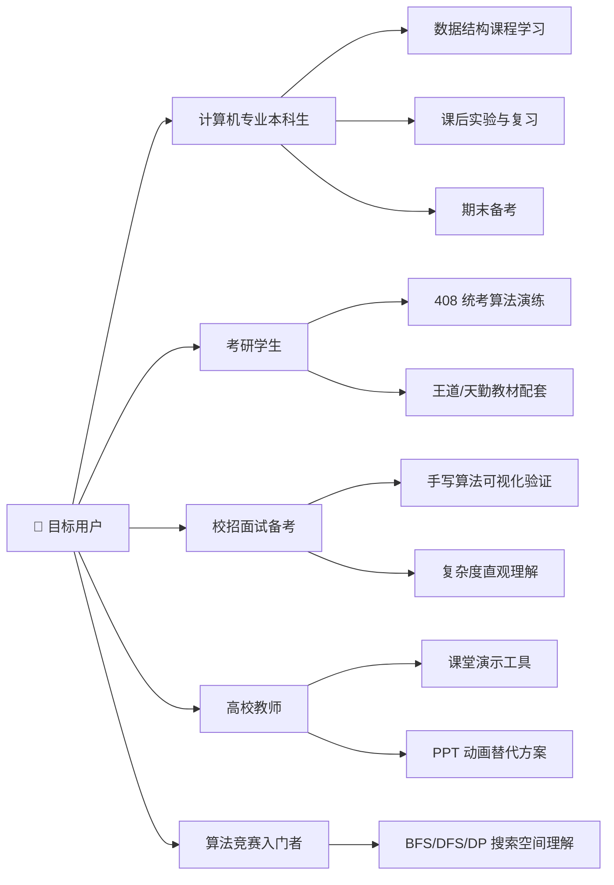
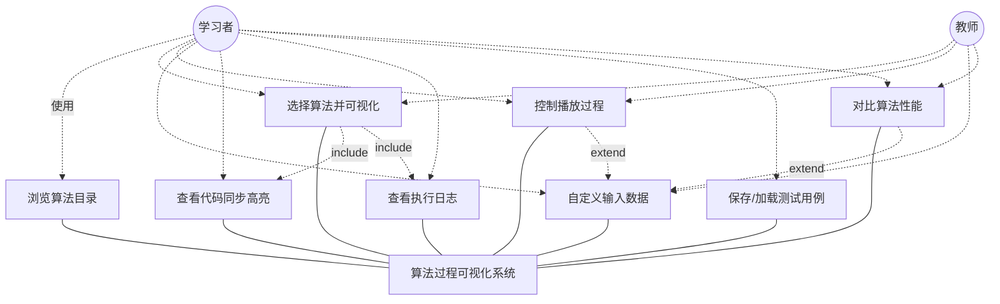
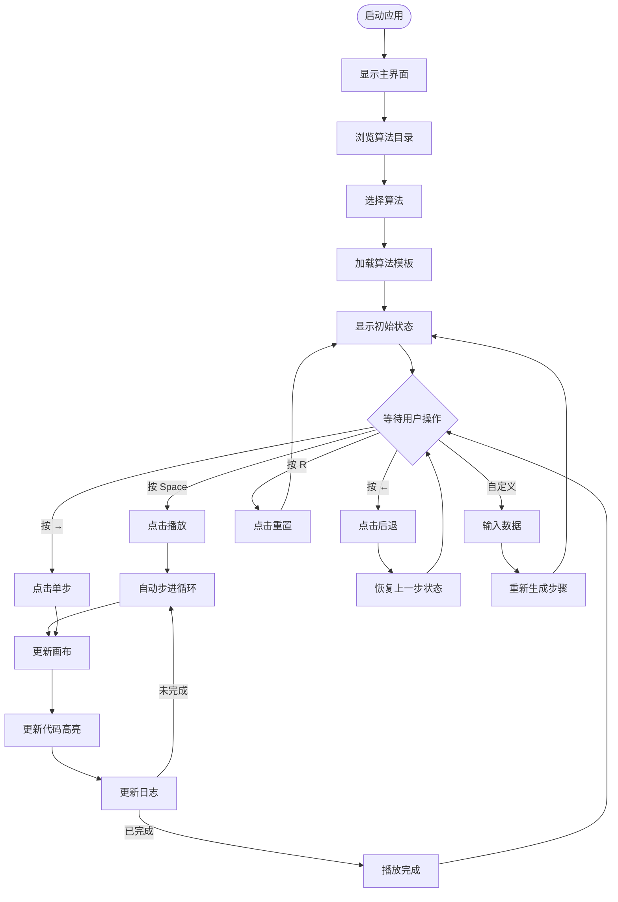
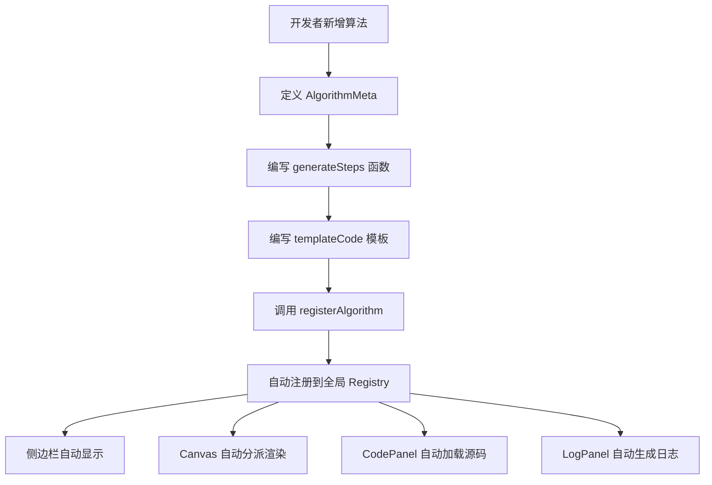
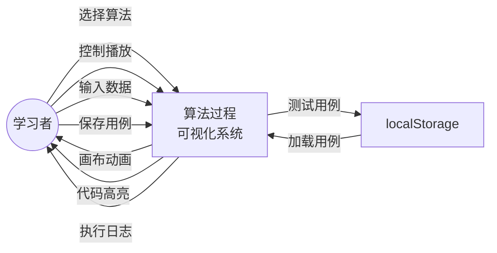
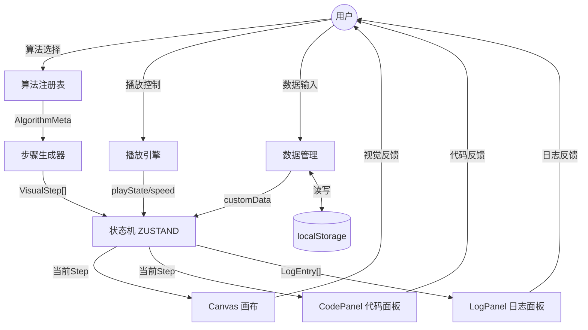
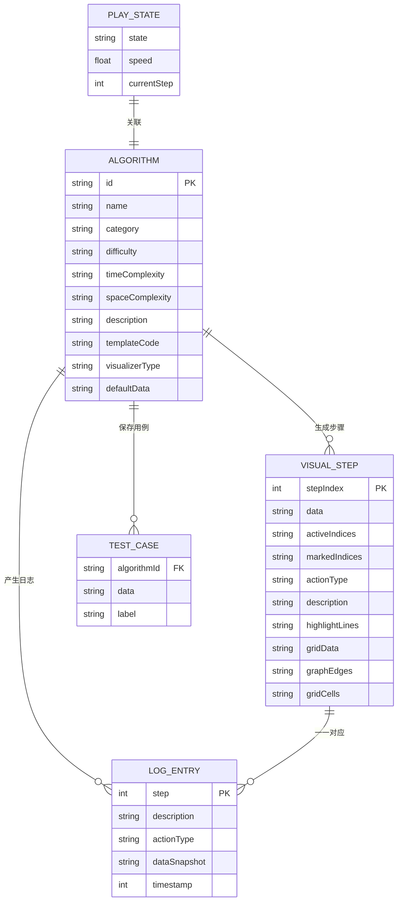
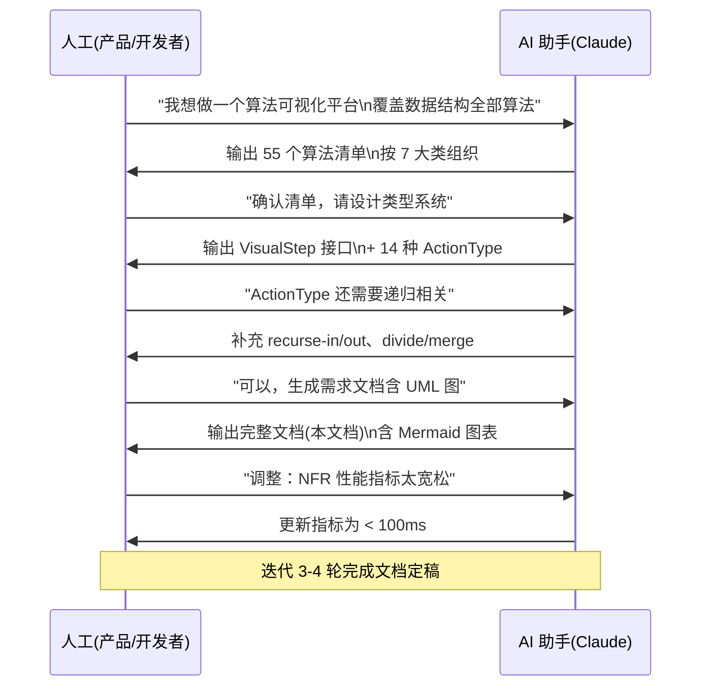
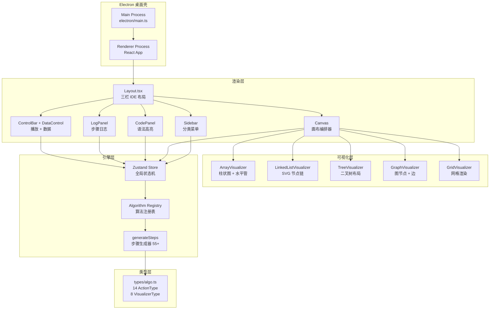

# 算法过程可视化系统 — 需求分析文档

> 版本: v3.0 | 日期: 2026-06-19 | 平台: Electron + React + TypeScript + Canvas + Mermaid

---

## 目录

1. [问题定义](#一问题定义)
2. [可行性研究](#二可行性研究)
3. [需求分析](#三需求分析)
   - [3.1 用例图](#31-用例图)
   - [3.2 活动图](#32-活动图)
   - [3.3 数据流图](#33-数据流图)
   - [3.4 E-R 图](#34-e-r-图)
   - [3.5 功能需求详述](#35-功能需求详述)
   - [3.6 非功能需求](#36-非功能需求)
4. [AI 辅助需求分析使用说明](#四ai-辅助需求分析使用说明)

---

## 一、问题定义

### 1.1 背景

数据结构与算法是计算机科学与技术专业的核心课程，也是考研、校招面试的重中之重。然而，传统教学方式存在以下痛点：

| 痛点 | 具体表现 |
|------|---------|
| **静态教学** | 教材用静态图示描述动态过程，学生难以形成时间维度的认知 |
| **代码理解断层** | 能看懂代码，但无法将代码执行流程与数据变化建立映射 |
| **实验门槛高** | 需要配置 IDE、安装编译器、编写测试代码，初学者入门成本大 |
| **缺乏交互性** | 视频/PPT 单向灌输，学生无法改变输入数据观察不同行为 |
| **算法对比困难** | 不同算法在同等条件下的对比缺乏直观工具 |

### 1.2 系统目标

构建一套**桌面级算法过程可视化教学平台**，实现：

1. **所见即所算**：代码执行到哪一行，画布同步展示对应的数据状态变化
2. **全算法覆盖**：覆盖线性表、栈队列、树、图、排序、查找、高级专题共 7 大类 55+ 算法
3. **多模态反馈**：单一步骤在画布（图形动画）、代码面板（行高亮）、日志面板（中文解析）三处同步更新
4. **用户可干预**：自定义输入数据、调节播放速度、单步前进/后退，真正交互式学习
5. **桌面原生体验**：基于 Electron 的 M1 Mac 原生应用，离线可用

### 1.3 用户画像

### 1.4 核心用例概述

| 用例编号 | 用例名称 | 参与者 | 简要描述 |
|---------|---------|--------|---------|
| UC-01 | 浏览算法目录 | 学习者 | 按分类浏览 55+ 算法，查看难度与复杂度 |
| UC-02 | 选择算法并可视化 | 学习者 | 点击算法，画布自动渲染初始数据 |
| UC-03 | 控制播放过程 | 学习者 | 播放/暂停/单步/重置，调节速度 |
| UC-04 | 自定义输入数据 | 学习者 | 手动输入或随机生成测试数据 |
| UC-05 | 查看代码同步高亮 | 学习者 | 右侧代码面板当前行同步高亮 |
| UC-06 | 查看执行日志 | 学习者 | 阅读每步中文解析 + 历史记录 |
| UC-07 | 保存/加载测试用例 | 学习者 | 本地持久化常用测试数据 |
| UC-08 | 对比算法性能 | 学习者 | 多算法同数据分屏对比 |

---

## 二、可行性研究

### 2.1 技术可行性

| 维度 | 评估 | 说明 |
|------|------|------|
| **桌面框架** | 可行 | Electron 30+ 成熟稳定，原生支持 M1 ARM64 架构 |
| **前端渲染** | 可行 | React 18 + Framer Motion 11 提供声明式动画能力 |
| **画布绘制** | 可行 | SVG(树/图) + DOM(数组/链表) 混合渲染，覆盖所有可视化类型 |
| **状态管理** | 可行 | Zustand 4 轻量高性能，支持 setInterval 内安全的 getState() |
| **算法实现** | 可行 | TypeScript 原生实现，无第三方算法库依赖 |
| **离线运行** | 可行 | Electron 打包后本地运行，无需网络 |
| **团队技能** | 匹配 | React + TypeScript 栈为主流前端技能，学习曲线平缓 |

### 2.2 经济可行性

| 项目 | 说明 |
|------|------|
| **开发成本** | 全部使用开源技术栈（MIT/Apache 协议），零软件许可费用 |
| **硬件成本** | 开发用 M1 Mac 笔记本，无需服务器 |
| **部署成本** | 本地 .dmg 安装包分发，零服务器运维 |
| **维护成本** | 算法注册表模式扩展新算法仅需 ~100 行代码，维护成本低 |
| **收益** | 面向教育场景，可作为教学辅助工具长期使用 |

### 2.3 操作可行性

- **用户界面**：仿 VS Code 三栏 IDE 布局，目标用户（计算机专业学生）无需额外学习
- **交互方式**：鼠标点击 + 键盘快捷键（Space/←/→/R），与主流播放器一致
- **输入门槛**：逗号分隔数字即可自定义数据，单数字输入即可设置棋盘大小
- **运行环境**：macOS 11+，M1/M2/M3 系列芯片原生支持

### 2.4 法律可行性

- 全部代码自主开发，使用 MIT/Apache 协议的开源依赖
- 不涉及用户隐私数据采集
- 算法内容为计算机科学公共知识，无版权争议

### 2.5 可行性结论

**项目完全可行，建议立项开发。**

---

## 三、需求分析

### 3.1 用例图

### 3.2 活动图

#### 3.2.1 算法可视化主流程

#### 3.2.2 算法注册与扩展流程

### 3.3 数据流图

#### 3.3.1 顶层 DFD（0 层）

#### 3.3.2 一层 DFD

### 3.4 E-R 图

### 3.5 功能需求详述

#### FR-01：算法目录浏览

| 项目 | 内容 |
|------|------|
| **优先级** | P0（核心功能） |
| **描述** | 用户可按 7 大分类浏览全部算法，每个算法显示名称、难度标签（低/中/高）、时间复杂度、空间复杂度 |
| **输入** | 分类筛选条件（可选） |
| **输出** | 匹配算法列表 |
| **验收标准** | 所有已注册算法自动出现在对应分类下，无需手动维护列表 |

#### FR-02：算法可视化

| 项目 | 内容 |
|------|------|
| **优先级** | P0 |
| **描述** | 选择算法后，画布自动渲染初始数据。根据算法类型分派不同 Visualizer（数组柱状图/链表节点/树节点/图节点/网格） |
| **输入** | 算法 ID + 用户自定义数据（可选） |
| **输出** | 画布渲染初始状态 + 右侧代码面板显示源码 + 日志面板清空就绪 |
| **验收标准** | 5 种 Visualizer 类型均可正确渲染，activeIndices/markedIndices 颜色区分正确 |

#### FR-03：播放控制

| 项目 | 内容 |
|------|------|
| **优先级** | P0 |
| **描述** | 支持播放（Space）、暂停（Space）、单步前进（→）、单步后退（←）、重置（R）。支持 0.5x/1x/2x 速度调节 |
| **输入** | 键盘/鼠标操作 |
| **输出** | 画布/代码/日志三路同步更新 |
| **验收标准** | 步骤总数正确，进度条准确，到达末尾自动 completed |

#### FR-04：自定义数据

| 项目 | 内容 |
|------|------|
| **优先级** | P1 |
| **描述** | 用户可手动输入逗号分隔数据或点击随机生成。输入框提示适配算法类型 |
| **输入** | 逗号分隔数字字符串 / 单个数字 |
| **输出** | 算法以用户数据重新生成步骤并显示 |
| **验收标准** | 排序算法输入 "90,10,50" 后柱形图对应变化；N皇后输入 "8" 后显示 8×8 棋盘 |

#### FR-05：代码同步高亮

| 项目 | 内容 |
|------|------|
| **优先级** | P1 |
| **描述** | 右侧面板显示算法 TypeScript 源码，当前执行行蓝色左边框 + 背景高亮。支持语法着色 |
| **输入** | 当前 VisualStep 的 highlightLines |
| **输出** | 对应代码行高亮 |
| **验收标准** | 语法高亮覆盖 8 类 token，高亮行号与步骤描述一致 |

#### FR-06：执行日志

| 项目 | 内容 |
|------|------|
| **优先级** | P1 |
| **描述** | 上半区显示当前步骤中文解析（actionType 标签 + 描述 + 数据快照），下半区显示可滚动历史列表 |
| **输入** | 当前步骤 + 历史 LogEntry[] |
| **输出** | 日志面板实时更新 |
| **验收标准** | 播放过程中日志自动追加，滚动跟随当前步骤 |

#### FR-07：测试用例管理

| 项目 | 内容 |
|------|------|
| **优先级** | P2 |
| **描述** | 保存当前自定义数据为测试用例（localStorage），下拉选择加载 |
| **输入** | 保存/加载操作 |
| **输出** | 持久化数据读取写入 |
| **验收标准** | 关闭应用后重开，已存用例仍可加载 |

#### FR-08：算法对比模式（Phase 3）

| 项目 | 内容 |
|------|------|
| **优先级** | P3（远期规划） |
| **描述** | 选择 2-3 个同类型算法，使用相同初始数据分屏运行，底部统计面板对比步数/比较次数/交换次数 |
| **输入** | 多算法选择 + 共享数据 |
| **输出** | 分屏画布 + 统计对比表 |
| **验收标准** | 多算法独立动画互不干扰 |

### 3.6 非功能需求

| 编号 | 类别 | 需求描述 | 量化指标 |
|------|------|---------|---------|
| NFR-01 | 性能 | 单步渲染延迟 | < 100ms |
| NFR-02 | 性能 | 自动播放帧率 | ≥ 30fps（Framer Motion spring 动画） |
| NFR-03 | 可用性 | 学习成本 | 计算机专业学生首次使用 < 5 分钟上手 |
| NFR-04 | 可用性 | 键盘无障碍 | 全程可键盘操作（Space/方向键/R） |
| NFR-05 | 可扩展性 | 新增算法成本 | < 150 行代码（meta + generateSteps + templateCode） |
| NFR-06 | 可扩展性 | 新增 Visualizer 成本 | < 200 行代码（新建组件 + Canvas 加 case） |
| NFR-07 | 兼容性 | 操作系统 | macOS 11+（Apple Silicon 原生） |
| NFR-08 | 兼容性 | 离线运行 | 无需网络连接 |
| NFR-09 | 可靠性 | 类型安全 | TypeScript strict 模式，tsc --noEmit 零错误 |
| NFR-10 | 可维护性 | 代码规范 | 组件职责单一，算法逻辑与 UI 完全解耦 |

---

## 四、AI 辅助需求分析使用说明

### 4.1 使用的 AI 工具

本需求分析文档的编写过程中，使用了 **Claude Code (Anthropic Claude Opus 4.7)** 作为 AI 辅助分析工具。

### 4.2 AI 辅助的具体环节

| 环节 | AI 角色 | 人工角色 |
|------|--------|---------|
| **需求头脑风暴** | 基于用户一句话需求，AI 自动扩展为 55 个算法清单，覆盖 7 大类 | 人工确认算法选取是否符合教学目标 |
| **类型系统设计** | AI 提议 VisualStep 统一接口，包含 data/activeIndices/markedIndices/actionType 核心字段 | 人工审核接口的完备性和可扩展性 |
| **架构方案对比** | AI 提供 Zustand vs Redux vs Context 的对比分析 | 人工决策采用 Zustand |
| **用例图/活动图/DFD/E-R 图生成** | AI 通过 Mermaid 语法自动生成全套 UML 图表 | 人工审核业务逻辑是否正确 |
| **文档结构化** | AI 按照"问题定义→可行性研究→需求分析"的标准模板组织文档 | 人工补充领域知识和业务细节 |
| **非功能需求量化** | AI 提议性能指标和验收标准 | 人工根据实际场景调整阈值 |

### 4.3 AI 辅助的典型工作流

### 4.4 AI 使用的注意事项

| 注意点 | 说明 |
|--------|------|
| **AI 生成内容需人工审核** | 算法覆盖范围、UML 图语义正确性、非功能指标合理性均需人工确认 |
| **迭代式协作** | 不建议一次生成最终文档，应通过 3-5 轮"AI 生成→人工审查→反馈修正"迭代 |
| **领域知识由人提供** | 教学大纲、考纲范围、学生痛点等需人工输入，AI 仅做扩展和结构化 |
| **图表语法验证** | Mermaid 图表需在支持 Mermaid 的 Markdown 渲染器中预览确认 |
| **安全与隐私** | 本项目不涉及用户隐私数据，AI 辅助限定在需求分析和架构设计阶段 |

### 4.5 本项目的 AI 辅助统计

| 指标 | 数值 |
|------|------|
| AI 对话轮次 | 约 15 轮 |
| AI 生成代码行数 | ~3000 行 TypeScript/TSX |
| AI 生成文档行数 | ~500 行 Markdown |
| 人工修改比例 | 约 20%（主要集中在算法边界条件、UI 细节调整） |
| 图表数量 | 6 个 Mermaid 图（思维导图 ×1、用例图 ×1、状态图 ×1、流程图 ×1、DFD ×2、E-R 图 ×1、时序图 ×1） |

---

## 附录 A：技术架构一览

## 附录 B：算法覆盖全景图（55 个算法清单）

| # | 算法名称 | 分类 | 难度 | 时间复杂度 | 可视化类型 | 状态 |
|---|---------|------|------|-----------|-----------|------|
| 1 | 顺序表插入 | 线性表 | 低 | O(n) | array | ✅ |
| 2 | 顺序表删除 | 线性表 | 低 | O(n) | array | 🔲 |
| 3 | 顺序表查找 | 线性表 | 低 | O(n) | array | 🔲 |
| 4 | 单链表建立（头插法） | 线性表 | 中 | O(n) | linked-list | 🔲 |
| 5 | 单链表建立（尾插法） | 线性表 | 中 | O(n) | linked-list | 🔲 |
| 6 | 单链表删除节点 | 线性表 | 中 | O(n) | linked-list | 🔲 |
| 7 | 顺序栈入栈/出栈 | 栈队列 | 低 | O(1) | array(水平) | ✅ |
| 8 | 链栈操作 | 栈队列 | 中 | O(1) | linked-list | 🔲 |
| 9 | 循环队列入队/出队 | 栈队列 | 中 | O(1) | array(水平) | 🔲 |
| 10 | 链队列操作 | 栈队列 | 中 | O(1) | linked-list | 🔲 |
| 11 | 括号匹配 | 栈队列 | 中 | O(n) | array+text | 🔲 |
| 12 | 中缀转后缀 | 栈队列 | 高 | O(n) | array+text | 🔲 |
| 13 | 前序遍历 | 树 | 低 | O(n) | tree | ✅ |
| 14 | 中序遍历 | 树 | 低 | O(n) | tree | 🔲 |
| 15 | 后序遍历 | 树 | 低 | O(n) | tree | 🔲 |
| 16 | 层序遍历 | 树 | 中 | O(n) | tree | ✅ |
| 17 | BST 插入 | 树 | 中 | O(log n) | tree | ✅ |
| 18 | BST 查找 | 树 | 低 | O(log n) | tree | 🔲 |
| 19 | BST 删除 | 树 | 高 | O(log n) | tree | 🔲 |
| 20 | 堆的构建 | 树 | 中 | O(n) | tree | 🔲 |
| 21 | 堆排序 | 树 | 中 | O(n log n) | tree+array | ✅ |
| 22 | 哈夫曼树 | 树 | 高 | O(n log n) | tree | 🔲 |
| 23 | 邻接矩阵存储 | 图 | 低 | O(1) | graph+matrix | 🔲 |
| 24 | 邻接表存储 | 图 | 低 | O(1) | graph | 🔲 |
| 25 | BFS | 图 | 中 | O(V+E) | graph | ✅ |
| 26 | DFS | 图 | 中 | O(V+E) | graph | ✅ |
| 27 | Dijkstra | 图 | 高 | O((V+E)logV) | graph | ✅ |
| 28 | Floyd-Warshall | 图 | 高 | O(V³) | graph+matrix | 🔲 |
| 29 | Prim | 图 | 高 | O(E log V) | graph | 🔲 |
| 30 | Kruskal | 图 | 高 | O(E log E) | graph | 🔲 |
| 31 | 冒泡排序 | 排序 | 低 | O(n²) | array | ✅ |
| 32 | 选择排序 | 排序 | 低 | O(n²) | array | ✅ |
| 33 | 插入排序 | 排序 | 低 | O(n²) | array | ✅ |
| 34 | 快速排序 | 排序 | 中 | O(n log n) | array | ✅ |
| 35 | 归并排序 | 排序 | 中 | O(n log n) | array | ✅ |
| 36-40 | 希尔/计数/基数/桶排序 | 排序 | 中 | 各异 | array | 🔲 |
| 41 | 顺序查找 | 查找 | 低 | O(n) | array | ✅ |
| 42 | 二分查找 | 查找 | 低 | O(log n) | array | ✅ |
| 43-45 | 插值/斐波那契/BST查找 | 查找 | 中 | O(log n) | array/tree | 🔲 |
| 46 | DFS 迷宫生成 | 高级 | 高 | O(n) | grid | ✅ |
| 47 | BFS 迷宫求解 | 高级 | 中 | O(V+E) | grid | ✅ |
| 48 | DFS 迷宫求解 | 高级 | 中 | O(V+E) | grid | 🔲 |
| 49 | Flood Fill | 高级 | 低 | O(n) | grid | ✅ |
| 50 | A* 寻路 | 高级 | 高 | O(E) | grid | 🔲 |
| 51-53 | DP 背包/LCS/编辑距离 | 高级 | 高 | O(nW)/O(mn) | grid+table | 🔲 |
| 54 | 贪心活动选择 | 高级 | 中 | O(n log n) | timeline | 🔲 |
| 55 | N 皇后 | 高级 | 高 | O(n!) | grid | ✅ |

> ✅ = 已实现 (21个)　🔲 = 待实现 (34个)

---

