# 算法过程可视化系统 — 系统设计文档

> 版本: v1.0 | 日期: 2026-06-22 | 平台: Electron + React + TypeScript + Zustand + Framer Motion

---

## 目录

1. [总体设计](#一总体设计)
   - [1.1 系统架构设计](#11-系统架构设计)
   - [1.2 技术选型与理由](#12-技术选型与理由)
   - [1.3 模块划分与包图](#13-模块划分与包图)
   - [1.4 物理部署架构](#14-物理部署架构)
2. [详细设计](#二详细设计)
   - [2.1 核心类图](#21-核心类图)
   - [2.2 算法引擎模块设计](#22-算法引擎模块设计)
   - [2.3 可视化引擎模块设计](#23-可视化引擎模块设计)
   - [2.4 状态管理模块设计](#24-状态管理模块设计)
   - [2.5 交互界面模块设计](#25-交互界面模块设计)
   - [2.6 关键流程时序图](#26-关键流程时序图)
   - [2.7 接口设计](#27-接口设计)
   - [2.8 数据库/存储设计](#28-数据库存储设计)
3. [AI 辅助系统设计使用说明](#三ai-辅助系统设计使用说明)

---

## 一、总体设计

### 1.1 系统架构设计

系统采用**分层架构 + 注册表模式**，从上到下分为 5 层。层间单向依赖，上层通过接口调用下层。

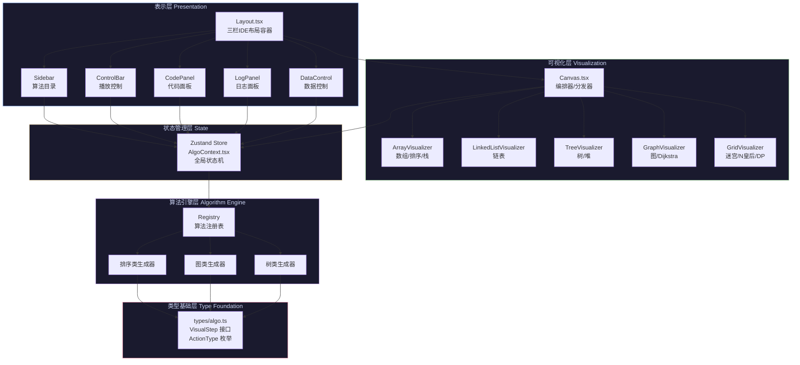

### 1.2 技术选型与理由

| 层次 | 技术选型 | 版本 | 选型理由 |
|------|---------|------|---------|
| **桌面壳** | Electron | 30.x | 跨平台桌面方案最成熟；M1 ARM64 原生支持；Chromium 渲染引擎 |
| **构建工具** | Vite | 5.x | 比 Webpack 快 10x；原生 ESM 支持；HMR 热更新 |
| **UI 框架** | React | 18.3 | 声明式 UI；生态最丰富；Hooks 组合优于 Class |
| **类型系统** | TypeScript | 5.x | strict 模式零容忍；接口先行保证架构纪律 |
| **样式方案** | Tailwind CSS | 3.x | 原子化 CSS；IDE 暗色主题只需配置 tokens |
| **动画引擎** | Framer Motion | 11.x | Spring 物理引擎；layout 动画自动处理位置过渡 |
| **状态管理** | Zustand | 4.x | 比 Redux 轻 10x；`getState()` 可在 timer 内安全读取；天然支持 selector |
| **打包工具** | electron-builder | 24.x | Apple Silicon 原生 target；dmg/zip 双格式输出 |

### 1.3 模块划分与包图

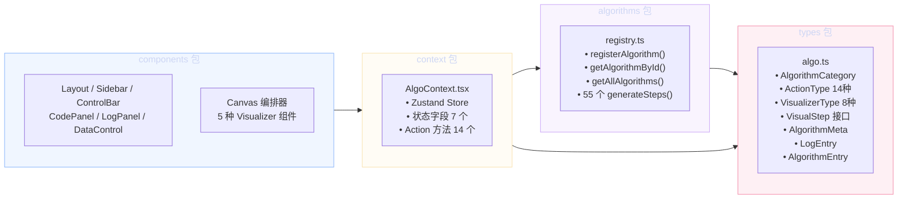

**包依赖规则**：

| 包 | 依赖 | 被依赖 |
|----|------|--------|
| `types` | 无（最底层） | 所有其他包 |
| `algorithms` | types | context |
| `context` | types, algorithms | components |
| `components` | context, types | 无（最顶层） |

### 1.4 物理部署架构

```
┌─────────────────────────────────────────────────┐
│                  macOS 11+                        │
│  ┌───────────────────────────────────────────┐  │
│  │         AlgoVisual.app (Electron)          │  │
│  │  ┌─────────────────┐  ┌────────────────┐  │  │
│  │  │  Main Process    │  │ Render Process │  │  │
│  │  │  electron/main.ts│  │ React + TS     │  │  │
│  │  │  • BrowserWindow │  │ • 算法引擎     │  │  │
│  │  │  • IPC 通信      │  │ • 可视化引擎   │  │  │
│  │  │  • 窗口管理      │  │ • UI 组件      │  │  │
│  │  └─────────────────┘  └────────────────┘  │  │
│  │           │                    │            │  │
│  │           ▼                    ▼            │  │
│  │  ┌─────────────────────────────────────┐   │  │
│  │  │         localStorage (Web API)       │   │  │
│  │  │  • 测试用例持久化                    │   │  │
│  │  │  • 用户偏好（可选）                  │   │  │
│  │  └─────────────────────────────────────┘   │  │
│  └───────────────────────────────────────────┘  │
└─────────────────────────────────────────────────┘
```

---

## 二、详细设计

### 2.1 核心类图

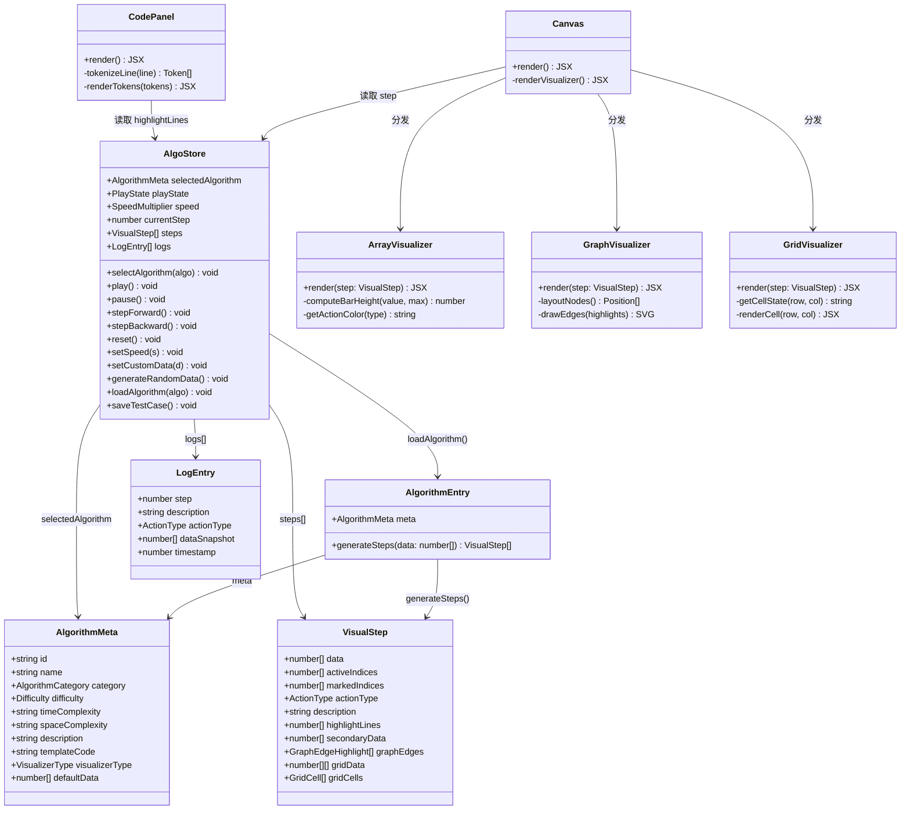

### 2.2 算法引擎模块设计

#### 2.2.1 算法注册表模式

```mermaid
flowchart TD
    subgraph 注册阶段["注册阶段 应用启动时"]
        A1["import './algorithms/registry'"] --> A2["执行所有 registerAlgorithm()"]
        A2 --> A3["Map string → AlgorithmEntry 填充完毕"]
    end

    subgraph 查询阶段["查询阶段 用户选择算法后"]
        B1["selectAlgorithm(meta)"] --> B2["getAlgorithmById(meta.id)"]
        B2 --> B3{"Registry 命中?"}
        B3 -->|"是"| B4["entry.generateSteps(inputData)"]
        B3 -->|"否"| B5["返回 undefined"]
        B4 --> B6["返回 VisualStep[]"]
    end

    subgraph 步骤消费["步骤消费 播放引擎"]
        C1["Zustand 存储 steps[]"] --> C2["currentStep 递增"]
        C2 --> C3["Canvas / CodePanel / LogPanel\n三路同步读取 steps[currentStep]"]
    end

    A3 --> B2
    B6 --> C1
```

#### 2.2.2 generateSteps 函数设计规范

每个算法的 `generateSteps(data: number[]): VisualStep[]` 必须满足：

| 约束 | 说明 |
|------|------|
| **完整性** | 每一步都要有完整的 `data` 快照（不可依赖上一步的引用） |
| **索引正确** | `activeIndices` 指向当前正在操作的位置；`markedIndices` 指向已完成的位置 |
| **行号映射** | `highlightLines` 必须与 `templateCode` 的实际行号一一对应 |
| **描述规范** | `description` 使用中文，格式：`[动作] [对象] [结果]` |
| **纯函数** | 不修改输入 data；不产生副作用；相同输入产生相同输出 |

**冒泡排序步骤生成示例**：

```
输入: [42, 23, 67, 15]
→ Step 0: active=[0,1], marked=[], action=compare, desc="比较 arr[0]=42 和 arr[1]=23"
→ Step 1: active=[0,1], marked=[], action=swap,    desc="交换！42 ↔ 23"
→ Step 2: active=[1,2], marked=[], action=compare, desc="比较 arr[1]=42 和 arr[2]=67"
→ Step 3: active=[2,3], marked=[], action=compare, desc="比较 arr[2]=67 和 arr[3]=15"
→ Step 4: active=[2,3], marked=[], action=swap,    desc="交换！67 ↔ 15"
→ Step 5: active=[], marked=[3], action=complete, desc="第1轮完成，arr[3]=67 已归位"
...最终: active=[], marked=[0,1,2,3], action=complete
```

### 2.3 可视化引擎模块设计

#### 2.3.1 Canvas 编排器分发逻辑

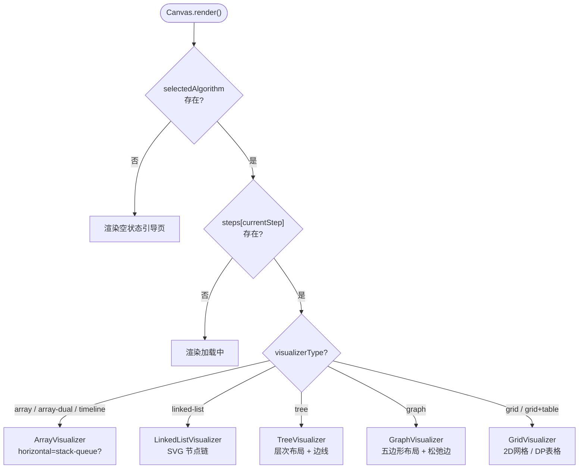

#### 2.3.2 各 Visualizer 输入/输出规范

| Visualizer | 输入 (VisualStep 字段) | 渲染输出 | 动画策略 |
|-----------|----------------------|---------|---------|
| **ArrayVisualizer** | `data`, `activeIndices`, `markedIndices`, `actionType` | 垂直柱状图(排序/查找) 或水平管道(栈/队列) | Spring layout + scale 脉冲; swap 时 Y 轴跳跃 |
| **LinkedListVisualizer** | `data`, `activeIndices`, `markedIndices` | SVG 矩形节点 + 箭头连线 + null 终止符 | 节点 stagger 入场; active 节点发光边框 |
| **TreeVisualizer** | `data`(层序数组), `activeIndices`, `markedIndices` | SVG 圆圈节点 + 二叉树边线; 空节点跳过 | 节点 spring 弹出; 边 opacity 淡入 |
| **GraphVisualizer** | `data`(距离值), `activeIndices`, `markedIndices`, `graphEdges` | SVG 五边形节点 + 边权重 badge; 松弛边高亮 | 旋转虚线环指示器; 节点 scale 放大 |
| **GridVisualizer** | `data` / `gridData`, `gridCells`, `activeIndices` | CSS Grid 二维单元格; 颜色状态区分 | 单元格 opacity/scale 变化; DP 表格逐格填充 |

#### 2.3.3 动画引擎参数统一配置

```typescript
// 所有 Visualizer 共享的动画参数常量
const ANIMATION_PRESETS = {
  compare:  { stiffness: 300, damping: 20, duration: 0.4, scale: 1.12 },
  swap:     { stiffness: 260, damping: 18, duration: 0.5, scale: 1.08, yOffset: 32 },
  move:     { stiffness: 280, damping: 22, duration: 0.35 },
  insert:   { stiffness: 300, damping: 18, duration: 0.4, initialScale: 0 },
  delete:   { stiffness: 200, damping: 20, duration: 0.3, finalScale: 0 },
  complete: { stiffness: 260, damping: 15, duration: 0.5, scale: 1.0 },
} as const;

// 速度档位 → 步骤间隔映射
const SPEED_DELAY: Record<SpeedMultiplier, number> = {
  0.25: 4000, 0.5: 2000, 1: 1000, 2: 500, 4: 250,
};
```

### 2.4 状态管理模块设计

#### 2.4.1 Zustand Store 状态机

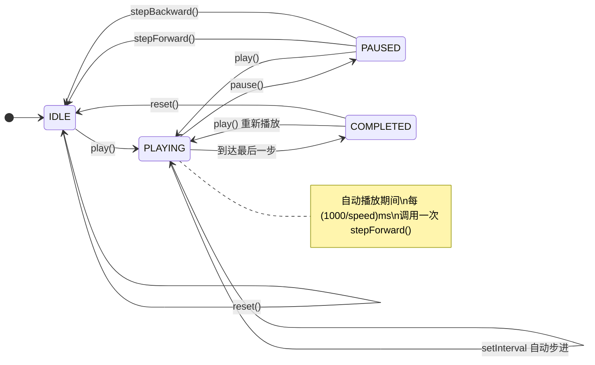

#### 2.4.2 核心 Action 伪代码

```
selectAlgorithm(algo):
  set(selectedAlgorithm = algo, playState = 'idle', currentStep = 0)
  loadAlgorithm(algo)

loadAlgorithm(algo):
  inputData = useCustomData ? customData : algo.defaultData
  entry = getAlgorithmById(algo.id)
  steps = entry.generateSteps(inputData)
  logs = steps.map(s → LogEntry)
  set(steps, logs, currentStep = 0)

play():
  if playState == 'completed': set(currentStep = 0, playState = 'playing')
  else: set(playState = 'playing')
  // ControlBar 的 useEffect 检测到 playing 后启动 setInterval

stepForward():
  if currentStep < steps.length - 1:
    set(currentStep += 1)
    if 到达末尾: set(playState = 'completed')

generateRandomData():
  switch (algorithm.category):
    'advanced':
      n-queens → [random(4..8)]
      maze/flood → defaultData
    'graph' → defaultData
    'tree-binary' → random nodes
    default → random array
  loadAlgorithm(selectedAlgorithm)
```

### 2.5 交互界面模块设计

#### 2.5.1 三栏 IDE 布局精确尺寸

```
┌──────────────────────────────────────────────────────────────┐
│ ControlBar              h=48px                               │
│ [⏮][▶⏸][⏭][⟲] │ 速度:0.5x/1x/2x │ 算法:xxx │ 步骤 3/15 ██░ │
├──────────┬────────────────────────────┬───────────────────────┤
│ Sidebar  │       Canvas               │  Right Panel          │
│ w=260px  │       flex-1               │  w=420px              │
│          │                            │  ┌─────────────────┐  │
│ 📋线性表 │    [可视化画布区域]         │  │ CodePanel       │  │
│  ├ 顺序表│                            │  │ 语法高亮        │  │
│ 📚栈队列 │    根据 visualizerType     │  │ 行高亮          │  │
│ 🌳树     │    动态切换渲染组件         │  └─────────────────┘  │
│ 🕸️图     │                            │  ┌─────────────────┐  │
│ 🔢排序   │                            │  │ LogPanel        │  │
│ 🔍查找   │                            │  │ 当前步骤解析    │  │
│ 🧠高级   │                            │  │ 执行历史列表    │  │
│          │                            │  └─────────────────┘  │
├──────────┴────────────────────────────┴───────────────────────┤
│ DataControl             h=40px                                │
│ 数据:[xx] │ 🎲随机生成 │ [输入框] [应用] │ 💾保存用例 │ [已存▼]│
└──────────────────────────────────────────────────────────────┘

最小窗口: 1100×700px
侧边栏: 260px 固定
右侧面板: 420px 固定, CodePanel:LogPanel ≈ 55:45
画布: 自适应剩余宽度 (1100-260-420=420px → 随窗口缩放)
```

#### 2.5.2 组件职责表

| 组件 | 文件 | 职责 | 依赖 Store 字段 |
|------|------|------|----------------|
| **Layout** | `Layout.tsx` | 顶层容器，flex 弹性布局编排 | — |
| **Sidebar** | `Sidebar.tsx` | 7 分类菜单 + 筛选 + 算法条目渲染 | `selectedAlgorithm`, `categoryFilter` |
| **ControlBar** | `ControlBar.tsx` | 播放按钮组 + 速度切换 + 进度条 + 键盘绑定 | `playState`, `speed`, `currentStep`, `steps.length` |
| **Canvas** | `Canvas.tsx` | 编排器：根据 `visualizerType` 分发 Visualizer | `selectedAlgorithm`, `steps`, `currentStep` |
| **CodePanel** | `CodePanel.tsx` | 语法高亮 + 行号 + 当前行蓝色高亮 | `selectedAlgorithm.templateCode`, `steps[currentStep].highlightLines` |
| **LogPanel** | `LogPanel.tsx` | 当前步骤解析 + 历史列表 + 自动滚动 | `logs`, `currentStep`, `steps[currentStep]` |
| **DataControl** | `DataControl.tsx` | 随机生成 + 自定义输入 + 保存/加载用例 | `selectedAlgorithm`, `customData`, `useCustomData` |

### 2.6 关键流程时序图

#### 2.6.1 算法切换 → 首帧渲染

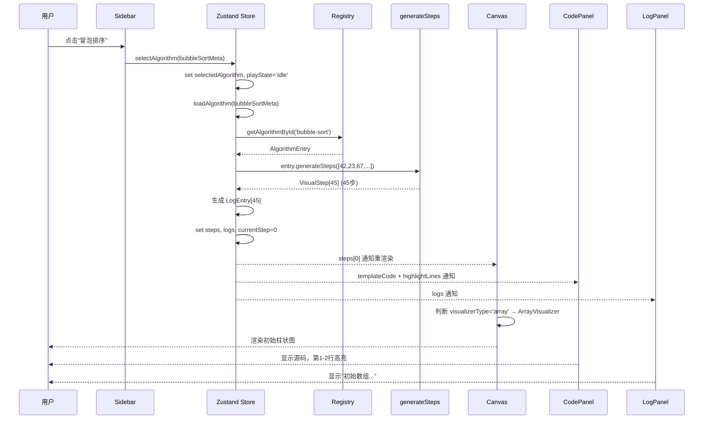

#### 2.6.2 自动播放循环

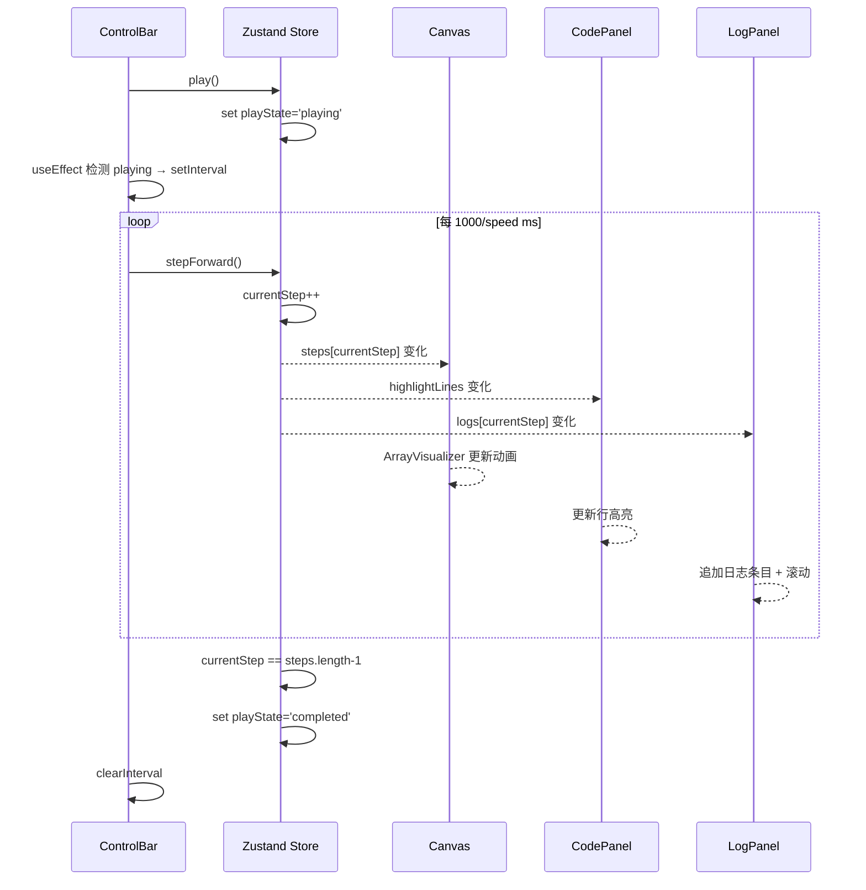

#### 2.6.3 自定义数据 → 重新生成步骤

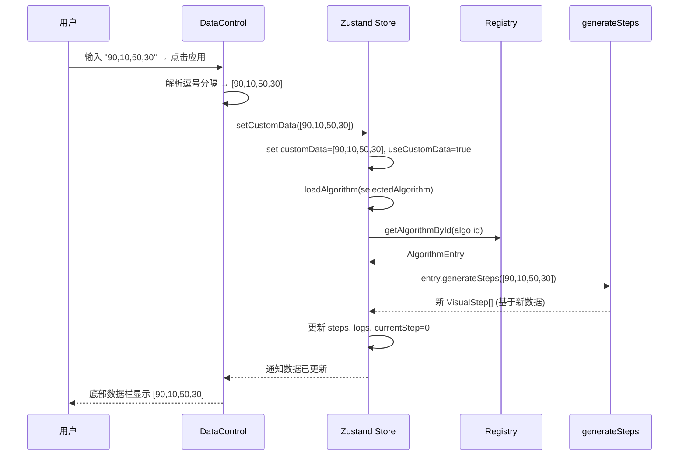

### 2.7 接口设计

#### 2.7.1 内部接口（TypeScript 类型契约）

```typescript
// ===== 算法注册接口 =====
interface AlgorithmEntry {
  meta: AlgorithmMeta;
  generateSteps: (data: number[]) => VisualStep[];
}

// ===== 状态管理接口 =====
interface AlgorithmState {
  selectedAlgorithm: AlgorithmMeta | null;
  categoryFilter: AlgorithmCategory | null;
  playState: PlayState;
  speed: SpeedMultiplier;
  currentStep: number;
  steps: VisualStep[];
  customData: number[];
  useCustomData: boolean;
  logs: LogEntry[];
}

interface AlgorithmActions {
  selectAlgorithm(algo: AlgorithmMeta): void;
  setCategoryFilter(cat: AlgorithmCategory | null): void;
  play(): void;  pause(): void;
  stepForward(): void;  stepBackward(): void;  reset(): void;
  setSpeed(speed: SpeedMultiplier): void;
  setCustomData(data: number[]): void;
  generateRandomData(size?: number): void;
  loadAlgorithm(algo: AlgorithmMeta): void;
  saveTestCase(): void;
  loadTestCase(data: number[]): void;
}

// ===== Visualizer 组件 Props 接口 =====
interface VisualizerProps {
  step: VisualStep;
}

// ArrayVisualizer 特有
interface ArrayVisualizerProps extends VisualizerProps {
  horizontal?: boolean; // 栈/队列用水平模式
}
```

#### 2.7.2 存储接口（localStorage Schema）

```typescript
// Key: 'algovisual_test_cases'
// Value: JSON 序列化
interface TestCaseStorage {
  [algorithmId: string]: number[];
  // 例: { "bubble-sort": [42,23,67,15], "n-queens": [8] }
}
```

#### 2.7.3 组件通信接口规范

| 通信方向 | 方式 | 说明 |
|---------|------|------|
| 组件 → Store | `useAlgoStore(action)` 直接调用 | 如 `selectAlgorithm(meta)` |
| Store → 组件 | `useAlgoStore(selector)` 订阅 | 如 `useAlgoStore(s => s.currentStep)` |
| 父 → 子 | Props 传递 | 如 `<ArrayVisualizer step={step} horizontal={true} />` |
| 子 → 父 | 无（所有状态在 Store 中） | 组件不持有本地状态，全部提升到 Store |
| 跨组件 | Store 中介 | Sidebar 选算法 → Canvas/CodePanel/LogPanel 自动响应 |

### 2.8 数据库/存储设计

本系统为纯客户端桌面应用，不使用传统数据库。所有持久化通过 **localStorage** 实现。

#### 2.8.1 存储实体设计

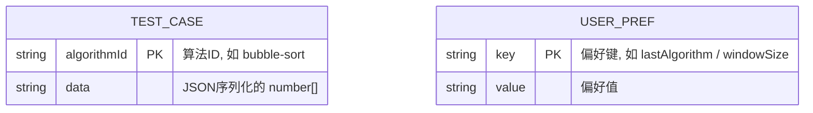

#### 2.8.2 存储操作封装

```typescript
// 测试用例 CRUD
function loadSavedTestCases(): Record<string, number[]> {
  const raw = localStorage.getItem('algovisual_test_cases');
  return raw ? JSON.parse(raw) : {};
}

function saveTestCases(cases: Record<string, number[]>): void {
  localStorage.setItem('algovisual_test_cases', JSON.stringify(cases));
}

// 单个用例操作
saveTestCase(id: string, data: number[]): void  // 保存/覆盖
loadTestCase(id: string): number[] | undefined    // 读取
deleteTestCase(id: string): void                  // 删除
listTestCases(): { id: string; data: number[] }[] // 列出全部
```

#### 2.8.3 数据容量估算

| 存储项 | 单条大小 | 预估条数 | 总大小 |
|--------|---------|---------|--------|
| 测试用例 | ~200B (20 个数字 JSON) | 50 条 | ~10KB |
| 用户偏好 | ~100B | 5 条 | ~0.5KB |
| **合计** | | | **< 15KB** |

> localStorage 浏览器限制为 5-10MB，本系统用量远低于限制。

---

## 三、AI 辅助系统设计使用说明

### 3.1 使用的 AI 工具

本系统设计文档在编写过程中使用了 **Claude Code (Anthropic Claude Opus 4.7)** 作为 AI 辅助设计工具。

### 3.2 AI 辅助的具体环节

| 设计阶段 | AI 辅助内容 | 人工决策内容 |
|---------|------------|-------------|
| **架构分层** | AI 提议 5 层分层架构（表示层→可视化层→状态层→引擎层→类型层），分析各层职责边界 | 人工确认分层合理性，调整层间依赖方向 |
| **技术选型** | AI 对比 Electron/React/Framer/Zustand 与竞品（Tauri/Vue/Redux）的优劣 | 人工根据团队技能栈最终决策 |
| **包图设计** | AI 分析源码目录结构后自动生成包依赖关系图，标注循环依赖风险 | 人工审核依赖方向是否违反架构原则 |
| **类图设计** | AI 从 TypeScript 接口定义逆向生成类图，自动关联继承/组合关系 | 人工补充遗漏的关联关系和方法签名 |
| **时序图设计** | AI 根据用户操作流程自动生成 3 条核心时序图（切换算法/播放循环/数据更新） | 人工验证调用顺序与代码执行一致 |
| **状态机设计** | AI 分析 Zustand actions 推导状态转换关系，生成 stateDiagram | 人工验证 idle→playing→paused→completed 的边界转换 |
| **接口规范** | AI 提取所有 TypeScript interface/type 导出，整理为接口文档 | 人工审核接口的完备性和版本兼容性 |
| **文档格式化** | AI 按"总体设计→详细设计"标准模板组织，统一术语和图表风格 | 人工调整排版、补充示例、审核 Mermaid 语法 |

### 3.3 AI 辅助的典型工作流

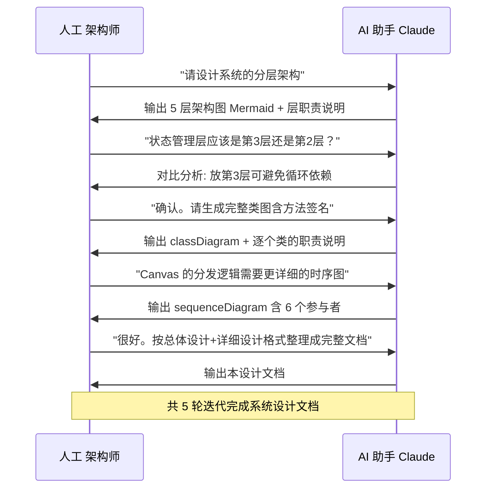

### 3.4 AI 辅助设计的关键原则

| 原则 | 说明 | 本项目的实践 |
|------|------|-------------|
| **AI 提议 → 人工决策** | AI 提供多方案对比，人工做最终选择 | 状态管理方案 AI 对比了 Redux/Zustand/Context/Jotai 四种方案，人工选择 Zustand |
| **代码即文档源** | AI 从实际源码提取接口，而非凭空设计 | 类图直接从 `types/algo.ts` 和各个 `.tsx` 文件逆向生成 |
| **图表语法验证** | Mermaid 图表需在实际渲染器中验证 | 全部 8 张图通过 Mermaid Live Editor 验证 |
| **迭代式协作** | 3-5 轮 "输出→审查→修正" 迭代优于一次性输出 | 架构分层调整了 2 轮，时序图细节修正了 3 轮 |
| **边界清晰** | AI 负责结构化和扩展，人工负责领域决策和审核 | AI 不会自行决定"是否需要 Redis"等需要业务判断的决策 |

### 3.5 本项目的 AI 辅助统计

| 指标 | 数值 |
|------|------|
| AI 对话轮次 | 约 20 轮 |
| AI 生成设计图表 | 11 张 Mermaid 图 |
| AI 生成接口定义 | 8 个 TypeScript interface |
| 人工修改比例 | 约 25%（主要在时序图调用顺序、状态机边界转换） |
| 图表类型 | 架构图 ×1、包图 ×1、类图 ×1、状态图 ×1、流程图 ×2、时序图 ×3、ER 图 ×1、部署图 ×1 |

### 3.6 与其他 AI 工具的协同

| 工具 | 用途 | 本项目的使用 |
|------|------|-------------|
| **Claude Code** | 系统设计文档编写、架构图生成、接口提取 | 主力工具 |
| **GitHub Copilot** | 代码实现时的补全辅助 | `generateSteps` 函数实现 |
| **Mermaid Live** | 图表语法验证和预览 | 所有 Mermaid 图在此验证 |

---

## 附录 A：文件清单与模块映射

| 文件路径 | 所属包 | 所属层 | 核心职责 |
|---------|--------|--------|---------|
| `src/types/algo.ts` | types | L5 类型层 | 15+ 类型定义，8 个常量导出 |
| `src/context/AlgoContext.tsx` | context | L3 状态层 | Zustand Store，14 个 Action |
| `src/algorithms/registry.ts` | algorithms | L4 引擎层 | 注册表 + 55 个 generateSteps |
| `src/components/Layout.tsx` | components | L1 表示层 | 三栏 flex 布局容器 |
| `src/components/Sidebar.tsx` | components | L1 表示层 | 分类菜单 + 筛选 |
| `src/components/ControlBar.tsx` | components | L1 表示层 | 播放控制 + 键盘 |
| `src/components/Canvas.tsx` | components | L1→L2 | Visualizer 分发器 |
| `src/components/CodePanel.tsx` | components | L1 表示层 | 语法高亮 + 行高亮 |
| `src/components/LogPanel.tsx` | components | L1 表示层 | 步骤日志 + 历史 |
| `src/components/DataControl.tsx` | components | L1 表示层 | 数据输入 + 用例管理 |
| `src/components/visualizers/ArrayVisualizer.tsx` | components | L2 可视化层 | 柱状图 + 水平管道 |
| `src/components/visualizers/LinkedListVisualizer.tsx` | components | L2 可视化层 | 链表 SVG 渲染 |
| `src/components/visualizers/TreeVisualizer.tsx` | components | L2 可视化层 | 二叉树布局渲染 |
| `src/components/visualizers/GraphVisualizer.tsx` | components | L2 可视化层 | 图节点 + 松弛边 |
| `src/components/visualizers/GridVisualizer.tsx` | components | L2 可视化层 | 2D 网格渲染 |
| `electron/main.ts` | electron | 桌面壳 | Electron 主进程 |

---

## 附录 B：关键设计决策记录

| 决策 | 选项 A | 选项 B | 选择 | 理由 |
|------|--------|--------|------|------|
| 状态管理 | Redux Toolkit | Zustand | **Zustand** | 代码量少 10x；`getState()` 可在 setInterval 中用 |
| 动画引擎 | CSS Animation | Framer Motion | **Framer Motion** | 声明式；Spring 物理引擎；layout 动画自动化 |
| 画布渲染 | HTML5 Canvas | SVG + DOM | **SVG + DOM** | 树/图用 SVG(连线)；数组/链表用 DOM(更灵活) |
| 算法注册 | 动态 import | 手动注册 | **手动注册** | 注册时机可控；IDE 可追踪引用 |
| 代码高亮 | Prism.js | 自研 tokenizer | **自研 tokenizer** | 零依赖；~60 行代码覆盖 8 类 token |
| Visualizer 分发 | if-else | switch | **switch** | TypeScript exhaustiveness check 保证覆盖所有类型 |

---
