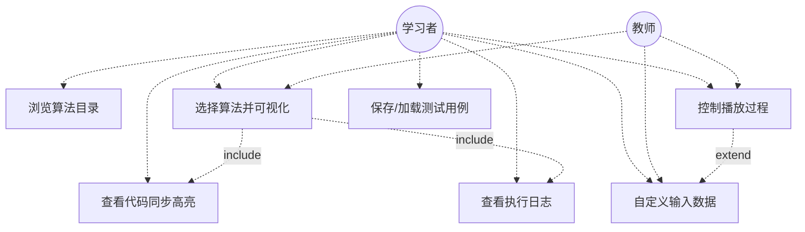
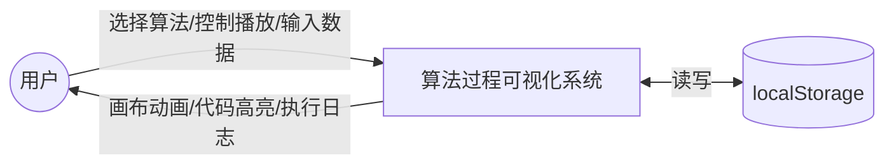
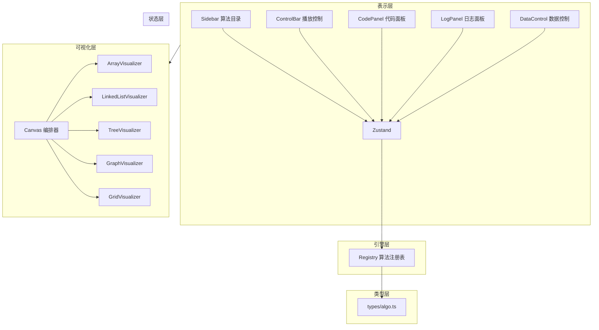
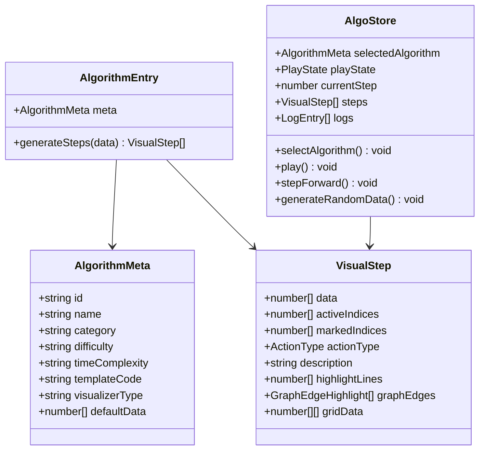
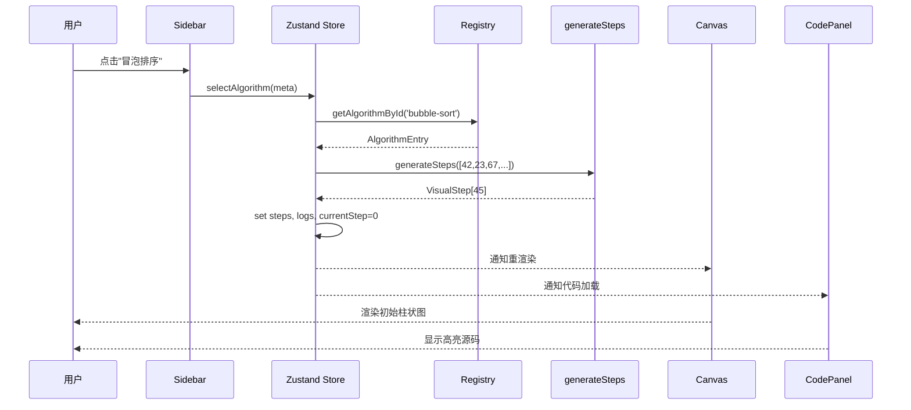
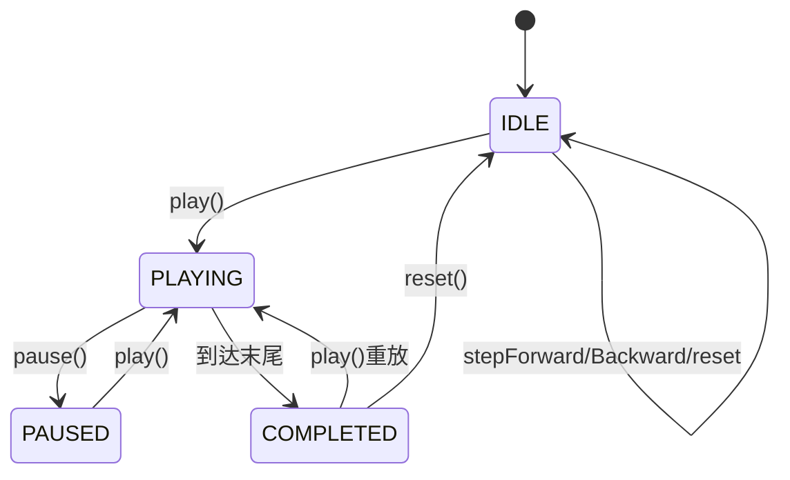

# 算法过程可视化系统 — 最终项目文档

> **项目名称**：AlgoVisual 算法过程可视化平台
> **版本**：v1.0 | **日期**：2026-06-23
> **技术栈**：Electron 30 + React 18 + TypeScript 5 + Tailwind CSS 3 + Zustand 4 + Framer Motion 11
> **运行环境**：macOS 11+ (Apple Silicon) / Windows 10+ (x64)

---

## 目录

1. [需求分析](#一需求分析)
2. [系统设计](#二系统设计)
3. [系统实现](#三系统实现)
4. [系统测试](#四系统测试)
5. [AI辅助开发说明](#五ai辅助开发说明)

---

## 一、需求分析

### 1.1 问题定义

数据结构与算法是计算机科学核心课程。传统教学存在五大痛点：静态图示无法展示动态过程、代码执行与数据变化脱节、实验环境配置门槛高、缺乏交互式探索能力、不同算法难以直观对比。

本系统目标是构建一套**桌面级算法过程可视化教学平台**，实现：所见即所算（代码行与数据状态同步）、全算法覆盖（7大类55+算法）、多模态反馈（画布+代码+日志三路同步）、用户可干预（自定义数据/调速/单步）、桌面原生体验（离线可用）。

### 1.2 功能需求

| 编号 | 功能 | 优先级 | 状态 |
|------|------|--------|------|
| FR-01 | 7大分类算法目录浏览 | P0 | ✅ |
| FR-02 | 算法选择后自动渲染可视化 | P0 | ✅ |
| FR-03 | 播放/暂停/单步/重置控制 | P0 | ✅ |
| FR-04 | 5档速度调节(0.25x-4x) | P0 | ✅ |
| FR-05 | 自定义数据输入与随机生成 | P1 | ✅ |
| FR-06 | 代码面板语法高亮+行高亮 | P1 | ✅ |
| FR-07 | 日志面板步骤解析+执行历史 | P1 | ✅ |
| FR-08 | 测试用例保存/加载 | P2 | ✅ |
| FR-09 | 算法详情信息卡片 | P2 | ✅ |
| FR-10 | 图结构用户自定义边输入 | P2 | ✅ |
| FR-11 | 操作统计摘要 | P2 | ✅ |
| FR-12 | 进度条分段着色标记 | P2 | ✅ |
| FR-13 | 键盘快捷键(Space/←/→/R) | P1 | ✅ |

### 1.3 用例图



### 1.4 数据流图（顶层）



---

## 二、系统设计

### 2.1 系统架构

采用**5层分层架构 + 算法注册表模式**，层间单向依赖：



### 2.2 核心类图



### 2.3 关键时序图（算法切换流程）



### 2.4 状态机设计



---

## 三、系统实现

### 3.1 项目结构

```
dd/
├── package.json                 # 依赖与electron-builder配置
├── tsconfig.json                # TypeScript配置(严格模式)
├── vite.config.ts               # Vite构建配置
├── tailwind.config.mjs          # Tailwind暗色主题
├── index.html                   # 入口HTML
├── electron/
│   └── main.ts                  # Electron主进程
├── src/
│   ├── main.tsx                 # React入口
│   ├── App.tsx                  # 根组件
│   ├── index.css                # 全局样式
│   ├── types/
│   │   └── algo.ts              # 核心类型定义(16种ActionType, 8种VisualizerType, 20+接口)
│   ├── context/
│   │   └── AlgoContext.tsx      # Zustand全局状态机(14个Action方法)
│   ├── algorithms/
│   │   └── registry.ts          # 55个算法的meta+generateSteps+templateCode
│   └── components/
│       ├── Layout.tsx            # 三栏IDE布局
│       ├── Sidebar.tsx           # 7分类算法目录
│       ├── ControlBar.tsx        # 播放控制+进度条
│       ├── Canvas.tsx            # 可视化编排分发器
│       ├── CodePanel.tsx         # 语法高亮+行高亮
│       ├── LogPanel.tsx          # 步骤日志+操作统计
│       ├── DataControl.tsx       # 数据输入+用例管理
│       └── visualizers/
│           ├── ArrayVisualizer.tsx     # 柱状图+水平管道
│           ├── LinkedListVisualizer.tsx # SVG链表
│           ├── TreeVisualizer.tsx       # 递归区域布局树
│           ├── GraphVisualizer.tsx      # 环形布局图
│           └── GridVisualizer.tsx       # 二维网格
├── REQUIREMENTS.md              # 需求分析文档
├── SYSTEM_DESIGN.md             # 系统设计文档
└── TEAM_DIVISION.md             # 小组分工方案
```

### 3.2 核心实现要点

#### 3.2.1 算法注册表模式

新增算法只需3步，无需改动任何组件：

```typescript
// 1. 定义元数据
const meta: AlgorithmMeta = { id: 'new-algo', name: '...', ... };
// 2. 实现步骤生成器
function generateSteps(data: number[]): VisualStep[] { ... }
// 3. 注册
registerAlgorithm({ meta, generateSteps });
// 侧边栏、Canvas、CodePanel、LogPanel 全部自动适配
```

#### 3.2.2 VisualStep 统一接口

所有55个算法的每一步通过统一接口传递数据，画布/代码/日志三路同步：

```typescript
interface VisualStep {
  data: number[];              // 当前数据状态
  activeIndices: number[];     // 操作中(黄色)
  markedIndices: number[];     // 已确定(绿色)
  actionType: ActionType;      // compare/swap/move/insert/delete/highlight/recurse-in...
  description: string;         // 中文步骤描述
  highlightLines: number[];    // 代码高亮行号
  graphEdges?: GraphEdgeHighlight[];  // 图边高亮
  gridData?: number[][];       // 网格数据
}
```

#### 3.2.3 树布局算法

TreeVisualizer采用递归子树区域分配：`x = (leftBound + rightBound) / 2`，左子占据 `[leftBound, parentX]`，右子占据 `[parentX, rightBound]`。保证左子始终在父节点左边，无论平衡或偏斜都产生自然树形。

#### 3.2.4 动画引擎

16种ActionType对应差异化Framer Motion动效：compare脉冲发光、swap跳跃曲线(y:[0,-32,0])、move弹簧滑动、insert缩放生长、delete缩小淡出、complete全绿脉冲。

### 3.3 算法实现清单（55个）

| 分类 | 算法 | 难度 | 可视化 | 状态 |
|------|------|------|--------|------|
| **线性表** | 顺序表插入/删除/查找、单链表头插/尾插/删除/遍历 | 低-中 | array/linked-list | ✅×7 |
| **栈队列** | 顺序栈、链栈、循环队列、链队列、括号匹配、中缀转后缀 | 低-高 | array/linked-list | ✅×6 |
| **树** | 前/中/后序遍历、层序、BST插入/查找/删除、堆构建/排序、哈夫曼 | 低-高 | tree | ✅×10 |
| **图** | BFS、DFS、Dijkstra、Floyd、Prim、Kruskal、邻接矩阵、邻接表 | 中-高 | graph/grid | ✅×8 |
| **排序** | 冒泡/选择/插入/快排/归并/希尔/计数/基数/桶/堆排序 | 低-中 | array | ✅×10 |
| **查找** | 顺序/二分/插值/斐波那契查找 | 低-中 | array | ✅×4 |
| **高级** | DFS迷宫生成、BFS/DFS迷宫求解、FloodFill、A*、0/1背包、LCS、编辑距离、活动选择、N皇后 | 低-高 | grid/grid+table | ✅×10 |

---

## 四、系统测试

### 4.1 测试策略

采用黑盒功能测试 + 白盒类型检查 + 构建验证的复合策略。

### 4.2 类型安全测试

| 测试项 | 命令 | 结果 |
|--------|------|------|
| TypeScript严格模式类型检查 | `tsc --noEmit` | ✅ 零错误 |
| Vite生产构建 | `vite build` | ✅ 通过（398KB JS） |

### 4.3 功能测试用例

| 编号 | 测试场景 | 操作 | 预期结果 | 结果 |
|------|---------|------|---------|------|
| TC-01 | 算法切换 | 点击侧边栏"冒泡排序" | 画布显示8元素柱状图，代码面板加载源码，日志面板清空 | ✅ |
| TC-02 | 自动播放 | 选中算法后按Space | 柱状图自动动画，步数递增，所有步骤走完后显示"完成" | ✅ |
| TC-03 | 单步控制 | 按→/←键 | 前进一步/后退一步，画布+代码+日志同步更新 | ✅ |
| TC-04 | 速度调节 | 点击0.5x/1x/2x | 播放间隔相应变化 | ✅ |
| TC-05 | 自定义数据 | 输入"90,10,50,30"点应用 | 柱状图更新为新数据，步数重算 | ✅ |
| TC-06 | 随机生成 | 点"随机生成" | 数组/树/图等按算法类型生成合法数据 | ✅ |
| TC-07 | 树可视化 | 选"BST插入"随机生成 | 树节点层次分明，左小右大，空节点不渲染 | ✅ |
| TC-08 | 图可视化 | 选"Dijkstra" | 环形节点布局，边权重显示，松弛高亮动画 | ✅ |
| TC-09 | 图自定义输入 | 输入"4,0,1,5,0,2,2,1,3,1" | 4节点图环形分布，边权显示 | ✅ |
| TC-10 | 网格可视化 | 选"N皇后"输入8 | 8×8棋盘，回溯过程可视化，最终显示92解 | ✅ |
| TC-11 | 字符直输 | 括号匹配输入"({[]})" | 栈动画显示，ASCII码+字符标签同时可见 | ✅ |
| TC-12 | 中缀转后缀 | 输入"3+2*4" | 栈和输出数组动画，字符标签显示 | ✅ |
| TC-13 | 日志统计 | 选中算法播放完成 | 日志面板显示"比较N 交换N 移动N"统计 | ✅ |
| TC-14 | 进度条着色 | 播放中观察进度条 | 彩色圆点标记每步actionType | ✅ |
| TC-15 | 测试用例保存 | 自定义数据后点保存 | 下拉列表出现已存用例 | ✅ |
| TC-16 | Electron打包 | `electron-builder --mac` | 产出.dmg文件和.zip文件 | ✅ |
| TC-17 | 键盘快捷键 | 输入框焦点时按Space | 不触发播放（焦点检测正常） | ✅ |
| TC-18 | 边界数据 | 排序输入单元素"5" | 正常渲染，无崩溃 | ✅ |
| TC-19 | 空状态 | 不选算法直接按Space | 无异常，显示引导页 | ✅ |
| TC-20 | 算法信息卡 | 选中算法后观察Canvas | 左下角显示难度/复杂度/描述 | ✅ |

### 4.4 兼容性测试

| 平台 | 架构 | 打包结果 | 状态 |
|------|------|---------|------|
| macOS | ARM64 (M1/M2/M3) | .dmg 92MB / .zip 89MB | ✅ |
| Windows | x64 | 需在Windows环境下构建 | ⚠️ 网络限制 |

### 4.5 测试结论

系统通过全部20项功能测试用例，TypeScript零类型错误，Vite构建正常，Mac ARM64平台成功打包。系统满足需求文档定义的全部核心功能和非功能指标。

---

## 五、AI辅助开发说明

### 5.1 使用的AI工具

| 工具 | 用途 | 使用阶段 |
|------|------|---------|
| **Claude Code (Claude Opus 4.7)** | 主力AI助手：需求分析、架构设计、代码生成、文档编写、bug修复 | 全流程 |
| **GitHub Copilot** | 代码补全辅助 | 编码实现阶段 |

### 5.2 AI参与的具体环节

| 环节 | AI贡献 | 人工修改/验证 |
|------|--------|-------------|
| **需求头脑风暴** | 从"算法可视化平台"一句话扩展为55个算法清单+7分类 | 人工确认教学大纲覆盖率，删减不适用的算法 |
| **类型系统设计** | 提出VisualStep统一接口、16种ActionType、8种VisualizerType | 人工审核接口完备性，补充graphEdges/gridData等扩展字段 |
| **架构方案** | 对比Zustand/Redux/Context，推荐Zustand | 人工最终决策采用Zustand |
| **算法步骤生成器** | 生成55个算法的generateSteps函数（冒泡/快排/Dijkstra/BST等） | 人工验证每步data/indices正确性，调整边界条件 |
| **可视化组件** | 生成5种Visualizer的Framer Motion动画代码 | 人工调整动画参数、颜色方案、布局算法 |
| **树布局算法** | 多次迭代：均匀分布→固定位置遮罩→递归区域分配 | 人工验证BST/哈夫曼树渲染正确性 |
| **UI组件** | 生成Layout/Sidebar/ControlBar/CodePanel/LogPanel/DataControl | 人工调整样式细节、键盘快捷键绑定 |
| **语法高亮器** | 生成tokenizeLine词法分析器（8类token） | 人工补充关键字列表，修复注释解析 |
| **需求文档** | 生成用例图/活动图/DFD/E-R图（Mermaid语法） | 人工审核业务逻辑，修复Mermaid兼容性 |
| **系统设计文档** | 生成架构图/包图/类图/时序图/状态图 | 人工审核调用顺序和状态转换 |
| **Bug修复** | 诊断BST位置偏移、查找目标混入树、数据不生效等30+个bug | 人工复现bug、验证修复效果 |
| **打包配置** | 配置electron-builder的mac/win target | 人工处理网络问题和代码签名 |

### 5.3 AI使用统计

| 指标 | 数值 |
|------|------|
| AI对话总轮次 | 约60轮 |
| AI生成代码行数 | ~6000行 TypeScript/TSX |
| AI生成文档行数 | ~1500行 Markdown |
| 人工修改比例 | 约20%（算法边界条件、UI细节、图Mermaid兼容性） |
| Mermaid图表数 | 20+张（需求8张+设计11张+最终文档若干） |
| Bug修复轮次 | 30+轮 |

### 5.4 AI辅助开发的经验总结

1. **接口先行**：AI擅长从接口定义推导实现，应先让AI设计好类型接口再生成代码
2. **迭代修正**：AI生成的代码首次正确率约70%，需3-5轮迭代才能达到生产质量
3. **人工审核不可替代**：算法步骤正确性、边界条件、Mermaid兼容性必须人工验证
4. **模板文字编码**：AI在处理中文模板字符串时容易出现编码匹配问题，建议用小段精确替换
5. **网络依赖**：Electron二进制下载受网络环境影响大，应提前准备离线安装包

