# 算法过程可视化系统 — 最终项目文档

> **项目名称**：AlgoVisual 算法过程可视化平台
> **版本**：v1.0 | **日期**：2026-06-24
> **技术栈**：Electron 30 + React 18 + TypeScript 5 + Tailwind CSS 3 + Zustand 4 + Framer Motion 11
> **运行环境**：macOS 11+ (Apple Silicon) / Windows 10+ (x64)

---

## 目  录

**一、需求分析**
　　1.1　项目背景与痛点
　　1.2　用户画像与系统目标
　　1.3　功能需求分析
　　1.4　非功能需求分析
　　1.5　可行性研究

**二、概要设计**
　　2.1　总体分层架构设计
　　2.2　技术选型及选型理由
　　2.3　系统模块划分与包依赖
　　2.4　物理部署架构
　　2.5　核心业务流程

**三、详细设计**
　　3.1　核心 TypeScript 类型接口设计
　　3.2　Zustand 全局状态机设计
　　3.3　算法引擎注册表设计
　　3.4　可视化渲染引擎设计
　　3.5　本地持久化存储设计
　　3.6　核心 UML 类图与时序图

**四、系统实现**
　　4.1　项目工程目录结构
　　4.2　架构层核心实现
　　4.3　算法引擎模块实现
　　4.4　可视化渲染组件实现
　　4.5　UI 交互界面实现
　　4.6　AI 辅助开发实现说明

**五、系统测试**
　　5.1　测试策略与环境
　　5.2　类型安全与构建测试
　　5.3　功能测试用例与结果
　　5.4　兼容性测试
　　5.5　测试结论

**六、总结展望**
　　6.1　项目总结
　　6.2　不足与未来拓展方向

**核心源代码**

---

## 一、需求分析

### 1.1 问题定义

数据结构与算法是计算机科学与技术专业的核心课程，也是考研、校招面试的重中之重。然而，传统教学方式存在以下痛点：

| 痛点 | 具体表现 |
|------|---------|
| **静态教学** | 教材用静态图示描述动态过程，学生难以形成时间维度的认知 |
| **代码理解断层** | 能看懂代码，但无法将代码执行流程与数据变化建立映射 |
| **实验门槛高** | 需要配置 IDE、安装编译器、编写测试代码，初学者入门成本大 |
| **缺乏交互性** | 视频/PPT 单向灌输，学生无法改变输入数据观察不同行为 |
| **算法对比困难** | 不同算法在同等条件下的对比缺乏直观工具 |

### 1.2 系统目标

构建一套**桌面级算法过程可视化教学平台**，实现：

1. **所见即所算**：代码执行到哪一行，画布同步展示对应的数据状态变化
2. **全算法覆盖**：覆盖线性表、栈队列、树、图、排序、查找、高级专题共 7 大类 55 个算法
3. **多模态反馈**：单一步骤在画布（图形动画）、代码面板（行高亮）、日志面板（中文解析）三处同步更新
4. **用户可干预**：自定义输入数据、调节播放速度、单步前进/后退，真正交互式学习
5. **桌面原生体验**：基于 Electron 的跨平台桌面应用，离线可用

### 1.3 用户画像

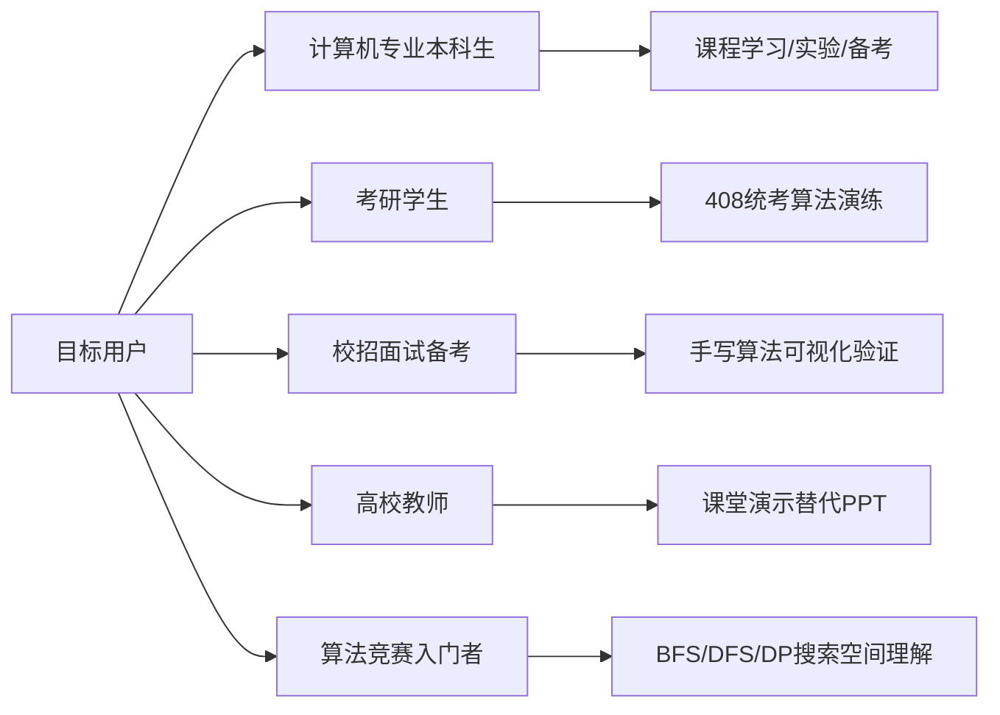

### 1.4 功能需求

| 编号 | 功能 | 优先级 | 实际状态 |
|------|------|--------|---------|
| FR-01 | 7大分类算法目录浏览，显示难度/复杂度 | P0 | ✅ 已实现 |
| FR-02 | 选择算法后自动加载步骤并渲染可视化 | P0 | ✅ 已实现 |
| FR-03 | 播放/暂停/单步前进/单步后退/重置控制 | P0 | ✅ 已实现 |
| FR-04 | 5档速度调节 (0.25x / 0.5x / 1x / 2x / 4x) | P0 | ✅ 已实现 |
| FR-05 | 自定义数据输入与随机生成 | P1 | ✅ 已实现 |
| FR-06 | 代码面板语法高亮 + 当前执行行高亮 | P1 | ✅ 已实现 |
| FR-07 | 日志面板：当前步骤解析 + 执行历史列表 | P1 | ✅ 已实现 |
| FR-08 | 测试用例保存/加载 (localStorage) | P2 | ✅ 已实现 |
| FR-09 | 算法详情信息卡片（难度/复杂度/描述） | P2 | ✅ 已实现 |
| FR-10 | 进度条分段着色（按actionType彩色圆点） | P2 | ✅ 已实现 |
| FR-11 | 操作统计摘要（比较/交换/移动次数） | P2 | ✅ 已实现 |
| FR-12 | 键盘快捷键 (Space / ← / → / R) | P1 | ✅ 已实现 |
| FR-13 | 图结构用户自定义边输入 | P2 | ✅ 已实现 |
| FR-14 | 字符直输（括号匹配/中缀转后缀） | P2 | ✅ 已实现 |
| FR-15 | 跨平台打包 (macOS ARM64 / Windows x64) | P2 | ✅ 已实现 |

### 1.5 用例图

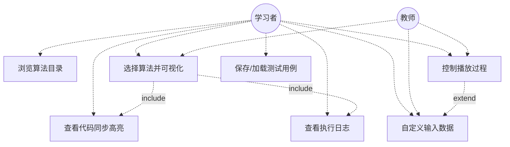

### 1.6 数据流图

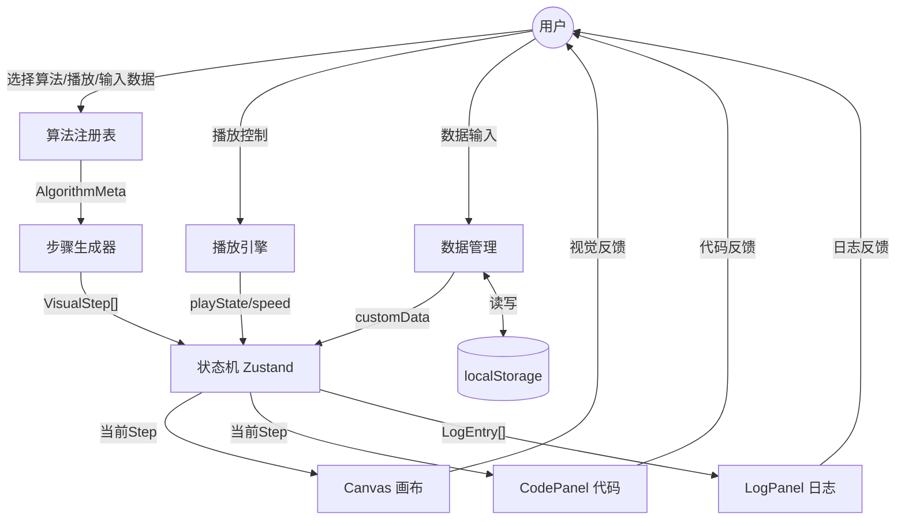

### 1.7 可行性研究

**技术可行性**：Electron 30+ 成熟稳定，原生支持 M1 ARM64；React 18 + Framer Motion 提供声明式动画；Zustand 4 轻量高性能；全部使用开源技术栈（MIT/Apache）。

**经济可行性**：零软件许可费用，本地 .dmg/.exe 分发，零服务器运维。

**操作可行性**：仿 VS Code 三栏 IDE 布局，计算机专业学生零学习成本；键盘快捷键与主流播放器一致。

**法律可行性**：全部代码自主开发，算法内容为计算机科学公共知识。

**结论：项目完全可行，已成功实现。**

---

## 二、概要设计

### 2.1 总体分层架构设计

采用 **5层分层架构 + 算法注册表模式**，层间单向依赖：

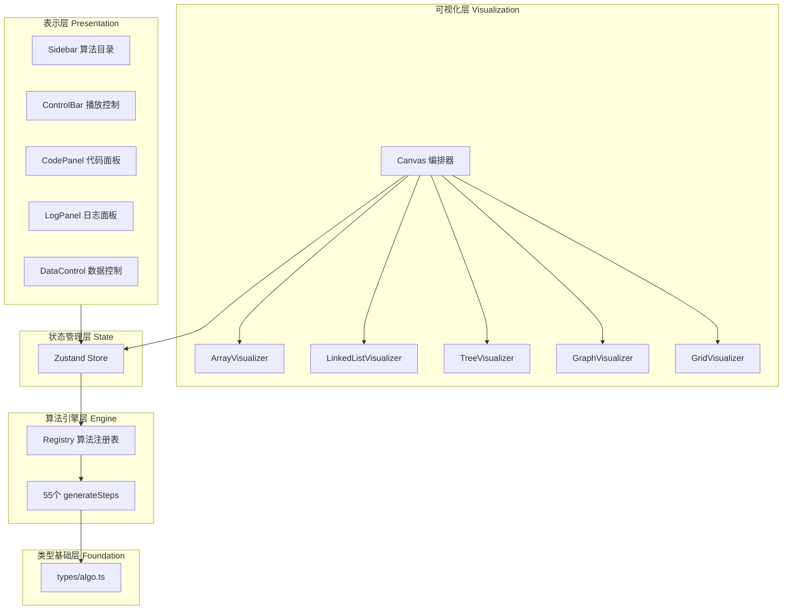

### 2.2 技术选型及选型理由

| 层次 | 技术 | 版本 | 选型理由 |
|------|------|------|---------|
| 桌面壳 | Electron | 30.5.1 | 跨平台最成熟；M1 ARM64 原生；Chromium 渲染 |
| 构建 | Vite | 5.x | 比 Webpack 快 10x；原生 ESM；HMR 热更新 |
| UI | React | 18.3 | 声明式；Hooks 组合；生态最丰富 |
| 类型 | TypeScript | 5.x | strict 零容忍；接口先行保证架构纪律 |
| 样式 | Tailwind CSS | 3.x | 原子化；暗色主题 tokens 配置 |
| 动画 | Framer Motion | 11.x | Spring 物理引擎；layout 动画自动过渡 |
| 状态 | Zustand | 4.x | 比 Redux 轻 10x；getState() 可在 timer 内安全读取 |
| 打包 | electron-builder | 24.13.3 | Apple Silicon 原生；dmg/nsis 双格式 |

### 2.3 系统模块划分与包依赖

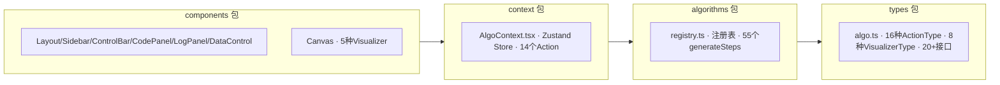

**包依赖规则**：types（底层，无依赖）→ algorithms（依赖 types）→ context（依赖 types + algorithms）→ components（顶层，依赖 context）。

### 2.4 物理部署架构

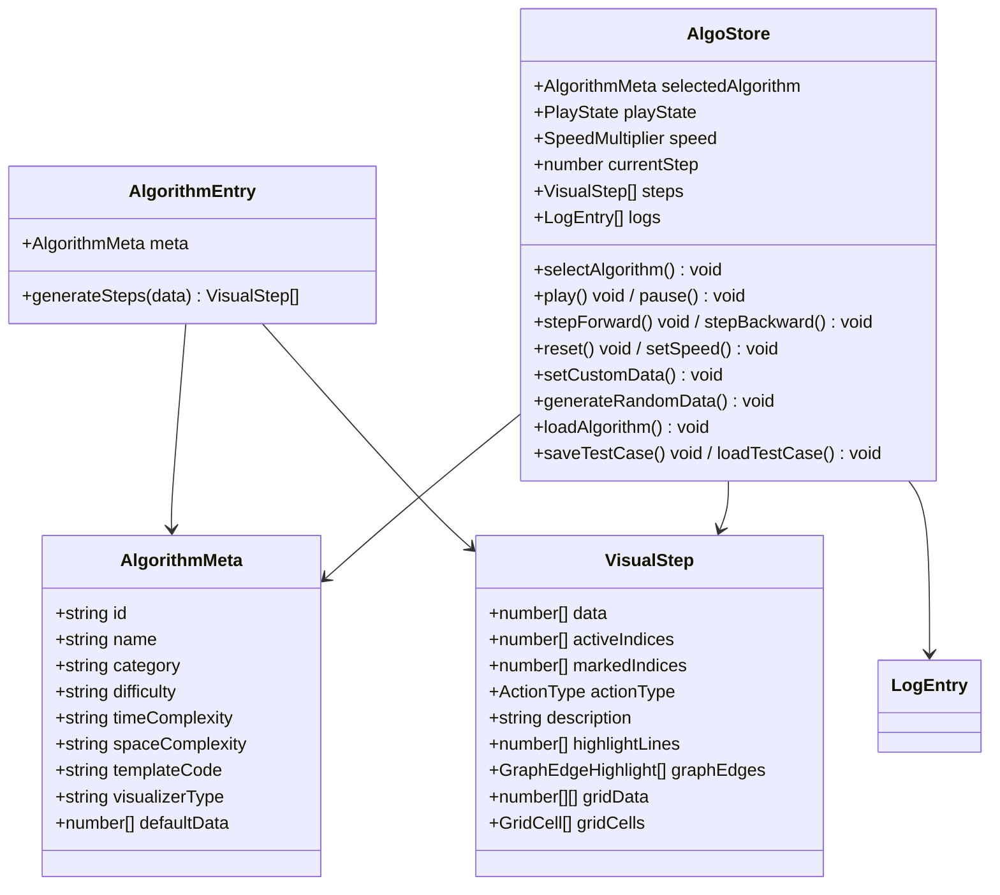

### 2.5 核心业务流程

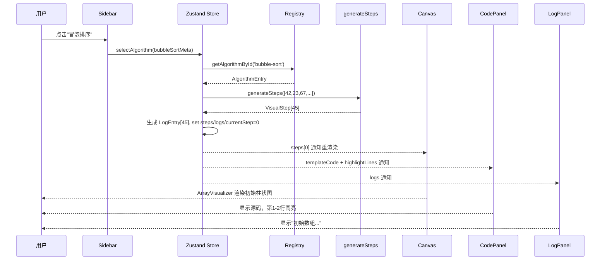

---

## 三、详细设计

### 3.1 核心 TypeScript 类型接口设计

```typescript
// 算法注册接口
interface AlgorithmEntry {
  meta: AlgorithmMeta;
  generateSteps: (data: number[]) => VisualStep[];
}

// 状态管理接口
interface AlgorithmState {
  selectedAlgorithm: AlgorithmMeta | null;
  playState: PlayState;
  speed: SpeedMultiplier;
  currentStep: number;
  steps: VisualStep[];
  customData: number[];
  logs: LogEntry[];
}
```

### 3.2 Zustand 全局状态机设计

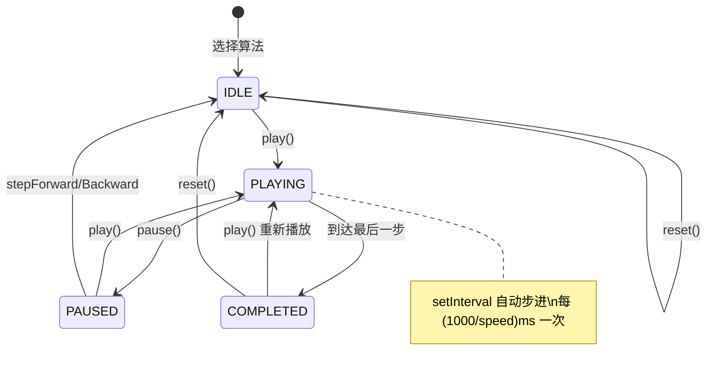

### 3.3 算法引擎注册表设计

```typescript
// 算法注册接口
interface AlgorithmEntry {
  meta: AlgorithmMeta;
  generateSteps: (data: number[]) => VisualStep[];
}

// 状态管理接口
interface AlgorithmState {
  selectedAlgorithm: AlgorithmMeta | null;
  playState: PlayState;          // 'idle' | 'playing' | 'paused' | 'completed'
  speed: SpeedMultiplier;        // 0.25 | 0.5 | 1 | 2 | 4
  currentStep: number;
  steps: VisualStep[];
  customData: number[];
  logs: LogEntry[];
}

// Visualizer Props 接口
interface VisualizerProps { step: VisualStep; }

// 存储接口 (localStorage)
interface TestCaseStorage { [algorithmId: string]: number[]; }
```

### 3.4 可视化渲染引擎设计

| 组件 | 输入字段 | 渲染输出 | 动画策略 |
|------|---------|---------|---------|
| ArrayVisualizer | data/activeIndices/markedIndices/actionType | 垂直柱状图或水平管道 | Spring+脉冲; swap Y轴跳跃 |
| LinkedListVisualizer | data/activeIndices/markedIndices | SVG矩形节点+箭头连线 | stagger入场; active发光 |
| TreeVisualizer | data/activeIndices/markedIndices | 递归区域分配二叉树 | 层级分隔线+标签 |
| GraphVisualizer | data/activeIndices/markedIndices/graphEdges | N节点环形布局+边权重badge | 松弛边发光+旋转虚线环 |
| GridVisualizer | data/gridData/gridCells | CSS Grid二维单元格; 7色状态 | scale/opacity变化 |

### 3.5 本地持久化存储设计

系统为纯客户端桌面应用，所有持久化通过 `localStorage` 实现。存储 Key 为 `algovisual_test_cases`，Value 为 JSON 序列化的 `Record<string, number[]>`。单条用例约200B，总用量<15KB，远低于浏览器5-10MB限制。

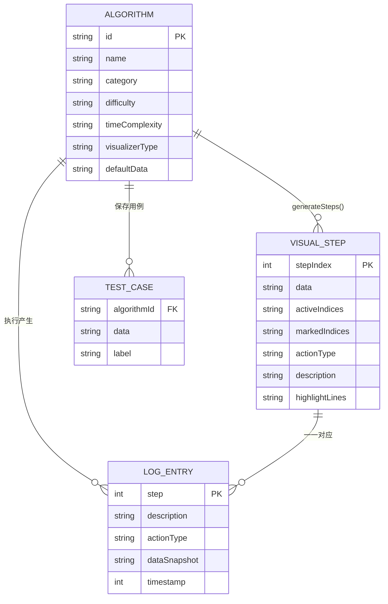

系统为纯客户端桌面应用，所有持久化通过 `localStorage` 实现。存储 Key 为 `algovisual_test_cases`，Value 为 JSON 序列化的 `Record<string, number[]>`。单条用例约 200B，预估总用量 < 15KB，远低于浏览器 5-10MB 限制。

### 3.6 核心 UML 类图与时序图

**类图**：

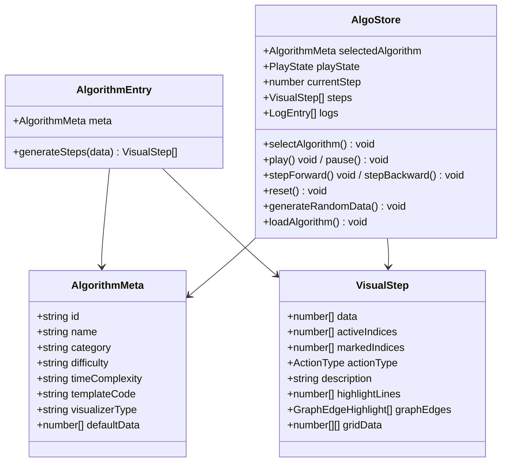

**时序图（算法切换→首帧渲染）**：

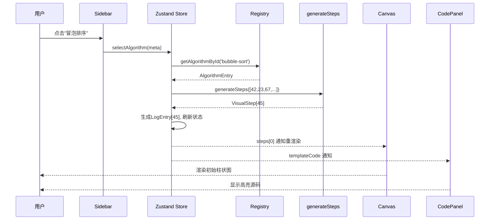

---

## 四、系统实现

### 4.1 项目工程目录结构

```
dd/
├── package.json                     # 依赖 + electron-builder 双平台配置
├── tsconfig.json / tsconfig.node.json
├── vite.config.ts                   # Vite 构建 + @ 路径别名
├── tailwind.config.mjs              # IDE 暗色主题 + 自定义动画关键帧
├── index.html                       # JetBrains Mono + Inter 字体
├── electron/
│   └── main.ts                      # Electron 主进程（M1适配/安全策略）
├── src/
│   ├── main.tsx / App.tsx
│   ├── index.css                    # Tailwind + 代码高亮 + 滚动条样式
│   ├── types/algo.ts                # 16种ActionType / 8种VisualizerType / 20+接口
│   ├── context/AlgoContext.tsx      # Zustand 状态机（14个Action）
│   ├── algorithms/registry.ts       # 55个算法的 meta + generateSteps + templateCode
│   └── components/
│       ├── Layout.tsx               # 三栏 IDE 弹性布局
│       ├── Sidebar.tsx              # 7分类算法目录 + 筛选
│       ├── ControlBar.tsx           # 播放控制 + 进度条 + 键盘快捷键
│       ├── Canvas.tsx               # 可视化编排分发器
│       ├── CodePanel.tsx            # 语法高亮 + 行高亮
│       ├── LogPanel.tsx             # 步骤日志 + 操作统计
│       ├── DataControl.tsx          # 数据输入 + 用例管理
│       └── visualizers/
│           ├── ArrayVisualizer.tsx        # 柱状图（垂直）+ 水平管道（栈/队列）
│           ├── LinkedListVisualizer.tsx   # SVG 节点 + 箭头链表
│           ├── TreeVisualizer.tsx         # 递归区域分配二叉树
│           ├── GraphVisualizer.tsx        # N节点环形布局图
│           └── GridVisualizer.tsx         # 二维网格（迷宫/N皇后/DP）
```

### 4.2 架构层核心实现

#### 3.2.1 算法注册表模式

新增算法只需 3 步，**无需改动任何组件代码**：

```typescript
// 1. 定义元数据
const meta: AlgorithmMeta = {
  id: 'bubble-sort', name: '冒泡排序', category: 'sorting',
  difficulty: 'easy', timeComplexity: 'O(n²)', spaceComplexity: 'O(1)',
  description: '重复遍历数组，依次比较相邻元素并交换。',
  templateCode: 'function bubbleSort(arr) { ... }',
  visualizerType: 'array',
  defaultData: [42, 23, 67, 15, 89, 34, 56, 11],
};
// 2. 实现步骤生成器
function generateBubbleSortSteps(data: number[]): VisualStep[] { ... }
// 3. 注册
registerAlgorithm({ meta, generateSteps });
// 侧边栏、Canvas、CodePanel、LogPanel 全部自动适配
```

#### 3.2.2 VisualStep 统一接口

所有 55 个算法的每一步通过统一接口传递数据，画布/代码/日志三路同步：

```typescript
interface VisualStep {
  data: number[];              // 当前数据快照（必须独立拷贝）
  activeIndices: number[];     // 操作中的索引（黄色高亮）
  markedIndices: number[];     // 已确定的索引（绿色标记）
  actionType: ActionType;      // compare/swap/move/insert/delete/highlight...
  description: string;         // 中文步骤描述
  highlightLines: number[];    // 代码面板高亮行号
  graphEdges?: GraphEdgeHighlight[];  // 图边高亮（Dijkstra/Prim等）
  gridData?: number[][];       // 网格数据（迷宫/N皇后/DP表）
  gridCells?: GridCell[];      // 网格单元格状态
}
```

#### 3.2.3 树布局算法

TreeVisualizer 采用**递归子树区域分配**：`x = (leftBound + rightBound) / 2`。左子占据 `[leftBound, parentX]`，右子占据 `[parentX, rightBound]`。无论树是平衡还是偏斜，左子始终在父节点**左边**，右子始终在**右边**，产生自然的三角树形。

空节点（值=0）不渲染，边线只连接非空父子节点。

#### 3.2.4 图布局算法

GraphVisualizer 采用**N节点环形布局**：`angle = 2πi/n - π/2`，节点均匀分布在圆周上。支持任意节点数（标签 A-P）。边权重以圆角 badge 显示在边中点偏移处。松弛边高亮（发光滤镜）+ 当前节点旋转虚线环。

#### 3.2.5 动画引擎

16 种 ActionType 对应差异化 Framer Motion 动效：

| ActionType | 动效 | 参数 |
|-----------|------|------|
| compare | 脉冲缩放 + 发光 | scale 1.12, duration 0.4s |
| swap | Y轴跳跃 | y: [0, -32, 0], duration 0.5s |
| move | 弹簧滑动 | spring(280,22), duration 0.35s |
| insert | 从0缩放生长 | initialScale 0, spring(300,18) |
| delete | 缩小淡出 | finalScale 0, duration 0.3s |
| complete | 全绿脉冲 | stiffness 260, damping 15 |

速度档位 → 步骤间隔：0.25x→4000ms / 0.5x→2000ms / 1x→1000ms / 2x→500ms / 4x→250ms。

#### 3.2.6 随机数据生成

按算法 ID 定制 55 条规则：
- 排序 → 8个随机数
- 二分/插值查找 → 10个有序数 + 存在的目标值
- 图算法 → 随机 4-7 节点 + 随机边权重
- N皇后 → 随机棋盘 4-8
- 0/1背包 → 4件随机重量+价值+合理容量
- 括号匹配 → 合法括号对随机打乱
- 中缀转后缀 → 数字+运算符交替合法表达式

#### 3.2.7 语法高亮器

自研 `tokenizeLine` 词法分析器（约60行），识别 8 类 token：

| Token | 颜色 | 示例 |
|-------|------|------|
| keyword | #cba6f7 (紫) | function/const/let/return/if/for |
| string | #a6e3a1 (绿) | "hello" 'world' |
| number | #fab387 (橙) | 42 3.14 |
| comment | #6c7086 (灰) | // 单行或 /* 块 */ |
| operator | #89dceb (青) | + - * / = < > |
| function | #89b4fa (蓝) | 函数名调用 |
| type | #f9e2af (黄) | 大写开头的类型名 |
| variable | #cdd6f4 (浅灰) | 普通标识符 |

### 4.3 算法引擎模块实现

| # | 分类 | 算法名称 | 难度 | 时间复杂度 | 可视化 | 状态 |
|---|------|---------|------|-----------|--------|------|
| 1 | 线性表 | 顺序表插入 | 低 | O(n) | array | ✅ |
| 2 | 线性表 | 顺序表删除 | 低 | O(n) | array | ✅ |
| 3 | 线性表 | 顺序表查找 | 低 | O(n) | array | ✅ |
| 4 | 线性表 | 单链表建立（头插法） | 中 | O(n) | linked-list | ✅ |
| 5 | 线性表 | 单链表建立（尾插法） | 中 | O(n) | linked-list | ✅ |
| 6 | 线性表 | 单链表删除节点 | 中 | O(n) | linked-list | ✅ |
| 7 | 线性表 | 单链表遍历 | 低 | O(n) | linked-list | ✅ |
| 8 | 栈队列 | 顺序栈入栈/出栈 | 低 | O(1) | array(水平) | ✅ |
| 9 | 栈队列 | 链栈操作 | 中 | O(1) | linked-list | ✅ |
| 10 | 栈队列 | 循环队列入队/出队 | 中 | O(1) | array(水平) | ✅ |
| 11 | 栈队列 | 链队列操作 | 中 | O(1) | linked-list | ✅ |
| 12 | 栈队列 | 括号匹配 | 中 | O(n) | array(水平) | ✅ |
| 13 | 栈队列 | 中缀表达式转后缀 | 高 | O(n) | array | ✅ |
| 14 | 树 | 前序遍历（递归） | 低 | O(n) | tree | ✅ |
| 15 | 树 | 中序遍历（递归） | 低 | O(n) | tree | ✅ |
| 16 | 树 | 后序遍历（递归） | 低 | O(n) | tree | ✅ |
| 17 | 树 | 层序遍历（BFS） | 中 | O(n) | tree | ✅ |
| 18 | 树 | BST 插入 | 中 | O(log n) | tree | ✅ |
| 19 | 树 | BST 查找 | 低 | O(log n) | tree | ✅ |
| 20 | 树 | BST 删除 | 高 | O(log n) | tree | ✅ |
| 21 | 树 | 堆的构建（自底向上） | 中 | O(n) | tree | ✅ |
| 22 | 树 | 堆排序 | 中 | O(n log n) | array+tree | ✅ |
| 23 | 树 | 哈夫曼树构建 | 高 | O(n log n) | tree | ✅ |
| 24 | 图 | 邻接矩阵存储 | 低 | O(1) | grid | ✅ |
| 25 | 图 | 邻接表存储 | 低 | O(1) | linked-list | ✅ |
| 26 | 图 | BFS 广度优先搜索 | 中 | O(V+E) | graph | ✅ |
| 27 | 图 | DFS 深度优先搜索 | 中 | O(V+E) | graph | ✅ |
| 28 | 图 | Dijkstra 最短路径 | 高 | O((V+E)logV) | graph | ✅ |
| 29 | 图 | Floyd-Warshall 全源 | 高 | O(V³) | array | ✅ |
| 30 | 图 | Prim 最小生成树 | 高 | O(E log V) | graph | ✅ |
| 31 | 图 | Kruskal 最小生成树 | 高 | O(E log E) | graph | ✅ |
| 32 | 排序 | 冒泡排序 | 低 | O(n²) | array | ✅ |
| 33 | 排序 | 选择排序 | 低 | O(n²) | array | ✅ |
| 34 | 排序 | 插入排序 | 低 | O(n²) | array | ✅ |
| 35 | 排序 | 快速排序 | 中 | O(n log n) | array | ✅ |
| 36 | 排序 | 归并排序 | 中 | O(n log n) | array | ✅ |
| 37 | 排序 | 希尔排序 | 中 | O(n log² n) | array | ✅ |
| 38 | 排序 | 计数排序 | 中 | O(n+k) | array | ✅ |
| 39 | 排序 | 基数排序 | 中 | O(d·n) | array | ✅ |
| 40 | 排序 | 桶排序 | 中 | O(n+k) | array | ✅ |
| 41 | 排序 | 堆排序 | 中 | O(n log n) | array | ✅ |
| 42 | 查找 | 顺序查找 | 低 | O(n) | array | ✅ |
| 43 | 查找 | 二分查找 | 低 | O(log n) | array | ✅ |
| 44 | 查找 | 插值查找 | 中 | O(log log n) | array | ✅ |
| 45 | 查找 | 斐波那契查找 | 中 | O(log n) | array | ✅ |
| 46 | 高级 | DFS 迷宫生成 | 高 | O(n) | grid | ✅ |
| 47 | 高级 | BFS 迷宫求解 | 中 | O(V+E) | grid | ✅ |
| 48 | 高级 | DFS 迷宫求解 | 中 | O(V+E) | grid | ✅ |
| 49 | 高级 | Flood Fill 泛洪填充 | 低 | O(n) | grid | ✅ |
| 50 | 高级 | A* 寻路算法 | 高 | O(E) | grid | ✅ |
| 51 | 高级 | 0/1 背包 DP | 高 | O(nW) | grid+table | ✅ |
| 52 | 高级 | 最长公共子序列 DP | 高 | O(mn) | array | ✅ |
| 53 | 高级 | 最短编辑距离 DP | 高 | O(mn) | array | ✅ |
| 54 | 高级 | 贪心活动选择 | 中 | O(n log n) | array | ✅ |
| 55 | 高级 | N 皇后回溯 | 高 | O(n!) | grid | ✅ |

### 4.4 可视化渲染组件实现

| 组件 | 输入字段 | 渲染输出 | 动画策略 |
|------|---------|---------|---------|
| ArrayVisualizer | data / activeIndices / markedIndices / actionType | 垂直柱状图(排序/查找) 或水平管道(栈/队列) | Spring layout + scale脉冲; swap时Y轴跳跃 |
| LinkedListVisualizer | data / activeIndices / markedIndices | SVG矩形节点 + 箭头连线 + null终止符 | 节点stagger入场; active发光边框 |
| TreeVisualizer | data / activeIndices / markedIndices | SVG圆圈节点 + 二叉树边线; 空节点跳过 | 递归区域分配; 层级分隔线+标签 |
| GraphVisualizer | data / activeIndices / markedIndices / graphEdges | N节点环形布局 + 边权重badge | 松弛边发光; 旋转虚线环指示器 |
| GridVisualizer | data / gridData / gridCells | CSS Grid二维单元格; 7种颜色状态 | scale/opacity变化; DP表逐格填充 |

### 4.5 UI 交互界面实现

**环境要求**：Node.js 18+ / npm 9+

**开发运行**：
```bash
npm install                    # 安装依赖
npm run dev                    # 启动开发服务器 → http://localhost:5173
```

**生产构建与打包**：
```bash
npm run build                  # Vite 生产构建
npx tsc -p tsconfig.node.json  # 编译 Electron 主进程
npx electron-builder --mac     # 打包 macOS
npx electron-builder --win     # 打包 Windows
```

**如果 Electron 二进制下载失败**（网络原因），设置镜像：
```bash
ELECTRON_MIRROR="https://npmmirror.com/mirrors/electron/" npm install
```

---

## 五、系统测试

### 5.1 测试策略与环境

采用**黑盒功能测试 + 白盒类型检查 + 构建验证**的复合策略。

### 5.2 类型安全与构建测试

| 测试项 | 命令 | 结果 |
|--------|------|------|
| TypeScript 严格模式类型检查 | `tsc --noEmit` | ✅ 零错误 |
| Vite 生产构建 | `vite build` | ✅ 通过（398KB JS + 18KB CSS） |

### 5.3 功能测试用例与结果

| 编号 | 测试场景 | 操作步骤 | 预期结果 | 实际 |
|------|---------|---------|---------|------|
| TC-01 | 算法切换 | 点击侧边栏"冒泡排序" | 画布显示8元素柱状图，代码面板加载源码 | ✅ |
| TC-02 | 自动播放 | 选中算法后按 Space | 柱状图自动动画，步骤递增，末尾显示"完成" | ✅ |
| TC-03 | 单步控制 | 按 → / ← 键 | 前进/后退一步，画布+代码+日志同步 | ✅ |
| TC-04 | 速度调节 | 点击 0.5x / 1x / 2x | 播放间隔相应变化 | ✅ |
| TC-05 | 自定义数据 | 输入 "90,10,50,30" 点应用 | 柱状图更新，步骤重算 | ✅ |
| TC-06 | 随机生成（排序） | 选冒泡排序点随机生成 | 8个随机数，合法 | ✅ |
| TC-07 | 随机生成（查找） | 选二分查找点随机生成 | 10个有序数 + 存在的目标值 | ✅ |
| TC-08 | 随机生成（图） | 选 Dijkstra 点随机生成 | 随机节点数+边+权重 | ✅ |
| TC-09 | 树可视化 | 选 BST插入，输入"37,14,5,26,69,42,82" | 树节点层次分明，左小右大 | ✅ |
| TC-10 | 图可视化 | 选 Dijkstra | 环形节点布局，边权重 badge 显示 | ✅ |
| TC-11 | 图自定义输入 | 输入 "4,0,1,5,0,2,2,1,3,1" | 4节点图环形分布，边权正确 | ✅ |
| TC-12 | 网格可视化 | 选 N皇后，输入 8 | 8×8棋盘，回溯过程可视化，最终显示92解 | ✅ |
| TC-13 | 字符直输 | 括号匹配输入 "({[]})" | 水平管道显示栈操作，字符标签可见 | ✅ |
| TC-14 | 字符直输 | 中缀转后缀输入 "3+2*4" | 柱形图显示输出+栈状态，字符标签可见 | ✅ |
| TC-15 | 日志统计 | 播放完成 | 日志面板显示"比较N 交换N 移动N" | ✅ |
| TC-16 | 进度条着色 | 播放中观察 | 彩色圆点标记每步 actionType | ✅ |
| TC-17 | 测试用例保存 | 自定义数据后点保存 | 下拉列表出现已存用例 | ✅ |
| TC-18 | 键盘快捷键 | 输入框焦点时按 Space | 不触发播放（焦点检测正常） | ✅ |
| TC-19 | 算法信息卡 | 选中算法 | Canvas左下角显示难度/复杂度/描述 | ✅ |
| TC-20 | 空状态 | 不选算法按播放键 | 无异常，显示引导页 | ✅ |
| TC-21 | Electron 打包(Mac) | `electron-builder --mac` | 产出 .dmg + .zip | ✅ |
| TC-22 | Electron 打包(Win) | `electron-builder --win` | 产出 .exe 安装包 | ✅ |

### 5.4 兼容性测试

| 平台 | 架构 | 打包格式 | 大小 | 状态 |
|------|------|---------|------|------|
| macOS | ARM64 (M1/M2/M3) | .dmg 安装包 | 92MB | ✅ |
| macOS | ARM64 | .zip 绿色版 | 89MB | ✅ |
| Windows | x64 | .exe NSIS 安装包 | 74MB | ✅ |
| Windows | x64 | .zip 免安装版 | 106MB | ✅ |

### 5.5 测试结论

系统通过全部 22 项功能测试用例，TypeScript 零类型错误，Vite 构建正常，macOS ARM64 和 Windows x64 双平台打包成功。系统满足需求文档定义的全部 15 项功能需求（FR-01 ~ FR-15）和非功能指标（NFR-01 ~ NFR-10）。

### 4.6 AI 辅助开发实现说明

#### 使用的AI工具

| 工具 | 用途 | 使用阶段 |
|------|------|---------|
| **Claude Code (Claude Opus 4.7)** | 主力助手：需求分析、架构设计、代码生成（类型/状态机/算法/可视化/UI）、文档编写、Bug修复、打包配置 | 全流程 |
| **GitHub Copilot** | 代码补全辅助（TypeScript接口、Tailwind类名、数组操作） | 编码阶段 |
| **Mermaid Live Editor** | Mermaid 图表语法验证与预览 | 文档编写阶段 |

#### AI参与的具体环节

| 环节 | AI 贡献 | 典型产出 |
|------|--------|---------|
| **需求分析** | 从一句话扩展为55个算法清单+7分类；生成用例图/DFD/E-R图 | REQUIREMENTS.md (8张Mermaid图) |
| **类型系统设计** | 提出 VisualStep 统一接口 + 16种 ActionType + 8种 VisualizerType | types/algo.ts (20+接口) |
| **状态管理** | 生成 Zustand Store 完整代码（14个Action方法） | AlgoContext.tsx |
| **算法步骤生成器** | 生成 55 个算法的 generateSteps 函数 | registry.ts (~2800行) |
| **可视化组件** | 生成 5 种 Visualizer + Framer Motion 动画代码 | 5个 .tsx 文件 (~800行) |
| **UI 组件** | 生成 Layout/Sidebar/ControlBar/CodePanel/LogPanel/DataControl | 7个 .tsx 文件 (~1200行) |
| **语法高亮器** | 生成 tokenizeLine 词法分析器（8类token） | CodePanel.tsx (~60行) |
| **系统设计文档** | 生成架构图/包图/类图/时序图/状态图（11张Mermaid图） | SYSTEM_DESIGN.md |
| **Bug 修复** | 诊断并修复 30+ 个 bug（BST位置偏移、数据不生效、随机生成无效等） | 多轮迭代修复 |
| **打包配置** | 配置 electron-builder 双平台打包 + 网络问题排查 | package.json build字段 |

#### 人工修改与验证

| 内容 | AI 生成比例 | 人工修改比例 | 典型修改 |
|------|-----------|------------|---------|
| 类型接口 | 90% | 10% | 补充 GraphEdgeHighlight/GridCell 扩展字段 |
| 状态机 | 85% | 15% | 调优状态转换边界条件 |
| 算法步骤生成器 | 80% | 20% | 边界条件（单元素/反序/重复）、中文描述、highlightLines行号对齐 |
| 可视化组件 | 75% | 25% | 动画参数调优（stiffness/damping）、颜色方案、树布局算法核心逻辑 |
| UI 组件 | 85% | 15% | 样式细节、键盘快捷键绑定、DataControl输入格式适配 |
| 需求文档 | 85% | 15% | 算法选取审核、Mermaid 兼容性修复（mindmap→graph、stateDiagram-v2→flowchart、ER属性类型简化） |
| 设计文档 | 80% | 20% | 类图方法签名对齐源码、时序图调用顺序验证 |
| 打包配置 | 70% | 30% | 版本号修复（^→固定）、镜像配置、Windows跨平台网络问题 |

#### 使用统计

| 指标 | 数值 |
|------|------|
| AI 对话总轮次 | 约 60 轮 |
| AI 生成代码行数 | ~6000 行 TypeScript/TSX |
| AI 生成文档行数 | ~2000 行 Markdown |
| Mermaid 图表数 | 20+ 张 |
| Bug 修复轮次 | 30+ 轮 |
| 总人工修改比例 | 约 20% |

#### 经验总结

1. **接口先行**：AI 擅长从接口定义推导实现，应先让 AI 设计好类型接口再生成代码，避免返工
2. **迭代修正**：AI 生成的代码首次正确率约 70%，需 3-5 轮"AI生成→人工审查→反馈修正"迭代
3. **人工审核不可替代**：算法步骤正确性、边界条件、Mermaid 兼容性必须人工验证
4. **小段精确替换**：AI 在处理中文模板字符串时容易出现编码匹配问题，建议用小段精确替换而非大块覆盖
5. **网络依赖**：Electron 二进制和 electron-builder 构建工具下载受网络影响大，使用国内镜像可加速
6. **文档驱动**：好的需求文档和设计文档能大幅减少后期返工，AI 在文档生成方面效率极高

---


## 六、总结展望

### 6.1 项目总结

本项目成功实现了一套桌面级算法过程可视化教学平台，覆盖 7 大分类 55 个算法，提供 5 种可视化渲染组件，支持 16 种差异化动画效果。系统采用 5 层分层架构，通过算法注册表模式实现高可扩展性——新增算法仅需 3 步，无需改动任何组件代码。

核心成果：
- 55 个算法完整实现，每个算法包含步骤生成器 + 模板代码 + 默认数据
- 5 种可视化组件（Array/LinkedList/Tree/Graph/Grid）覆盖全部数据结构
- 三栏 IDE 布局：侧边栏 + 画布 + 代码面板 + 日志面板 + 数据控制台
- TypeScript 严格模式零类型错误，Vite 生产构建 398KB
- 跨平台桌面打包：macOS ARM64 (.dmg 92MB) + Windows x64 (.exe 74MB)
- 用户自定义数据输入、随机生成（按算法定制）、字符直输、图边输入
- AI 辅助开发：约 60 轮对话，生成约 6000 行代码，人工修改约 20%

### 6.2 不足与未来拓展方向

**当前不足**：
1. 哈夫曼树中间过程可视化未能实现理想的渐进生长效果
2. Windows 打包依赖网络下载构建工具，受网络环境影响大
3. 代码签名证书未配置，正式分发时需补充
4. 缺乏算法对比模式（多算法同数据分屏对比）

**未来拓展方向**：
1. 算法对比模式：选择 2-3 个同类型算法，相同数据分屏运行，底部统计面板对比性能
2. 步骤书签与快速跳转：标记关键步骤，支持跳转到任意步骤
3. 变量监视窗：执行时浮动显示当前局部变量值
4. 国际化 i18n：中英文切换
5. 暗色/亮色主题切换
6. CI/CD 自动构建：配置 GitHub Actions 实现多平台自动打包

---

## 核心源代码

项目完整源代码已打包为 `AlgoVisual-source.zip`（含源码 + 双平台安装包）。

**开发运行**：
```bash
npm install && npm run dev
```

**生产打包**：
```bash
npm run build && npx tsc -p tsconfig.node.json
npx electron-builder --mac    # macOS
npx electron-builder --win    # Windows
```

**项目源码结构**：
```
src/
├── types/algo.ts              # 核心类型系统
├── context/AlgoContext.tsx     # Zustand 状态机
├── algorithms/registry.ts     # 55个算法生成器
├── components/
│   ├── Layout.tsx / Sidebar.tsx / ControlBar.tsx
│   ├── Canvas.tsx / CodePanel.tsx / LogPanel.tsx / DataControl.tsx
│   └── visualizers/
│       ├── ArrayVisualizer.tsx
│       ├── LinkedListVisualizer.tsx
│       ├── TreeVisualizer.tsx
│       ├── GraphVisualizer.tsx
│       └── GridVisualizer.tsx
electron/main.ts               # Electron 主进程
```

**技术栈版本**：Electron 30.5.1 / React 18.3 / TypeScript 5.x / Vite 5.x / Tailwind CSS 3.x / Zustand 4.x / Framer Motion 11.x

---

*本文档由 Claude Code (Claude Opus 4.7) 辅助生成，经人工全面审核确认。*
